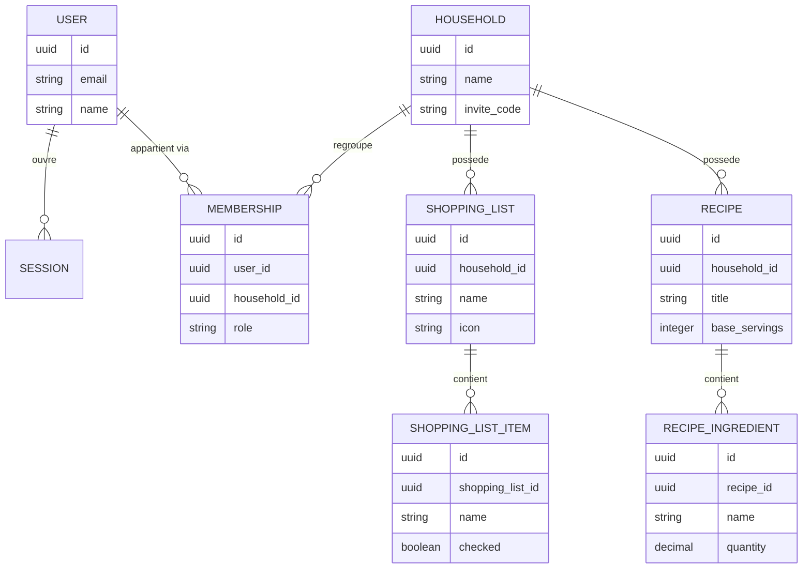
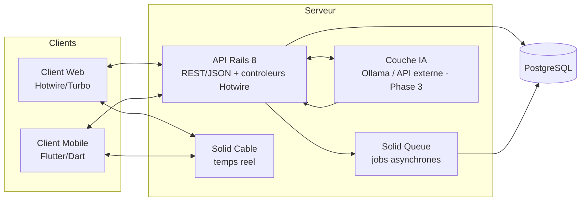

## Application collaborative et libre de gestion du foyer

**Version :** 1.0 — première version de travail **Statut :** document vivant, à itérer au fil de la conception détaillée et du développement

---

## Sommaire

0. [Préambule](https://claude.ai/chat/51a999ca-c74a-4e24-997c-e7684676a650#0-pr%C3%A9ambule)
1. [Objectifs du projet](https://claude.ai/chat/51a999ca-c74a-4e24-997c-e7684676a650#1-objectifs-du-projet)
2. [Périmètre et phasage](https://claude.ai/chat/51a999ca-c74a-4e24-997c-e7684676a650#2-p%C3%A9rim%C3%A8tre-et-phasage)
3. [Modèle économique, licence et gouvernance](https://claude.ai/chat/51a999ca-c74a-4e24-997c-e7684676a650#3-mod%C3%A8le-%C3%A9conomique-licence-et-gouvernance)
4. [Architecture technique](https://claude.ai/chat/51a999ca-c74a-4e24-997c-e7684676a650#4-architecture-technique)
5. [Points d'architecture transversaux à valider](https://claude.ai/chat/51a999ca-c74a-4e24-997c-e7684676a650#5-points-darchitecture-transversaux-%C3%A0-valider)
6. [Comportements communs à tous les modules](https://claude.ai/chat/51a999ca-c74a-4e24-997c-e7684676a650#6-comportements-communs-%C3%A0-tous-les-modules)
7. [Authentification et tableau de bord](https://claude.ai/chat/51a999ca-c74a-4e24-997c-e7684676a650#7-authentification-et-tableau-de-bord)
8. [Site vitrine, documentation et gouvernance](https://claude.ai/chat/51a999ca-c74a-4e24-997c-e7684676a650#8-site-vitrine-documentation-et-gouvernance)
9. [Modules prioritaires — Phase 2.a](https://claude.ai/chat/51a999ca-c74a-4e24-997c-e7684676a650#9-modules-prioritaires--phase-2a)
10. [Modules satellites simples — Phase 2.b](https://claude.ai/chat/51a999ca-c74a-4e24-997c-e7684676a650#10-modules-satellites-simples--phase-2b)
11. [Modules à logique métier riche — Phase 2.c](https://claude.ai/chat/51a999ca-c74a-4e24-997c-e7684676a650#11-modules-%C3%A0-logique-m%C3%A9tier-riche--phase-2c)
12. [Modules à écart d'architecture — Phase 2.d](https://claude.ai/chat/51a999ca-c74a-4e24-997c-e7684676a650#12-modules-%C3%A0-%C3%A9cart-darchitecture--phase-2d)
13. [Hest.IA — Vision cible (Phase 3)](https://claude.ai/chat/51a999ca-c74a-4e24-997c-e7684676a650#13-hestia--vision-cible-phase-3)
14. [Application mobile](https://claude.ai/chat/51a999ca-c74a-4e24-997c-e7684676a650#14-application-mobile)
15. [Interfaçage API](https://claude.ai/chat/51a999ca-c74a-4e24-997c-e7684676a650#15-interfa%C3%A7age-api)
16. [Dépendances externes — choix validés](https://claude.ai/chat/51a999ca-c74a-4e24-997c-e7684676a650#16-d%C3%A9pendances-externes--choix-valid%C3%A9s)
17. [Annexes](https://claude.ai/chat/51a999ca-c74a-4e24-997c-e7684676a650#17-annexes)
18. [Roadmap proposée et prochaines étapes](https://claude.ai/chat/51a999ca-c74a-4e24-997c-e7684676a650#18-roadmap-propos%C3%A9e-et-prochaines-%C3%A9tapes)
19. [Évolutions identifiées (hors périmètre V1)](https://claude.ai/chat/51a999ca-c74a-4e24-997c-e7684676a650#19-%C3%A9volutions-identifi%C3%A9es-hors-p%C3%A9rim%C3%A8tre-v1)

---

## 0. Préambule

Hestia est une application web et mobile de gestion collaborative du foyer, pensée comme une alternative libre, gratuite et auto-hébergeable aux applications propriétaires du même type. Le foyer y est l'unité de base : un compte foyer regroupe plusieurs membres (couple, famille, colocation) qui partagent en temps réel les mêmes modules — courses, calendrier, recettes, frigo, tâches, et une vingtaine d'autres domaines du quotidien.

À la différence des applications commerciales équivalentes, Hestia ne plafonne aucune fonctionnalité derrière un abonnement : le projet est distribué sous licence AGPLv3, le code est public, et chacun peut héberger sa propre instance sans dépendre d'un service tiers ni payer quoi que ce soit.

Ce document constitue la première version du cahier des charges fonctionnel et technique d'Hestia. Il couvre l'ensemble des 25 modules cibles avec un niveau de détail suffisant pour entamer la conception détaillée puis le développement, module par module. À l'origine, il partait du principe qu'aucune ligne n'était encore écrite ; ce n'est plus du tout le cas : le socle (Phase 1) et l'intégralité des 25 modules (Phase 2, vagues 2.a à 2.d) sont déjà scaffoldés dans le code — voir la section 0.1 pour le détail de ce qui est fait et de ce qui reste à compléter. Les choix d'architecture (section 4) restent des décisions de conception arrêtées ; ils sont globalement respectés par l'implémentation actuelle. La traduction de ce CDC en backlog ordonné vit dans le document compagnon *Plan d'implémentation — Hestia.md*.

---

## 0.1 État d'avancement (au 5 juillet 2026)

Contrairement à l'hypothèse initiale de ce document (« aucune ligne n'est encore écrite »), le dépôt contient une implémentation complète du périmètre fonctionnel de ce CDC, y compris l'essentiel des chantiers transversaux identifiés lors de la précédente revue. Cette section en fait le point ; le détail module par module et le détail version par version vivent respectivement dans *Plan d'implémentation — Hestia.md* et *CHANGELOG.md*.

**Déjà réalisé :**

- **Socle technique** (section 4) : Rails 8.1, PostgreSQL, Solid Queue / Solid Cable / Solid Cache, Hotwire (Turbo + Stimulus), ViewComponent, Tailwind v4, Docker / Kamal, intégration continue (`.github/workflows/ci.yml` : tests + RuboCop + Brakeman + bundler-audit).
- **Phase 1 — Socle applicatif, complète** : `User`, `Session`, `Household`, `Membership` (rôle `member`/`admin`, code d'invitation généré et unique), scoping multi-foyer (`Current.household`, concern `HouseholdScoped`), inscription, onboarding (créer/rejoindre un foyer via code), bascule de foyer actif, tableau de bord (`root`).
- **Phase 2 — les 25 modules, vagues 2.a à 2.d incluses.** Chaque module dispose de son ou ses modèle(s), de son contrôleur, de ses vues (composants `Ui::*` + Tailwind) et de l'essentiel du temps réel (Turbo Streams / Solid Cable via `broadcasts_to` / `broadcasts_refreshes_to`). Les 4 écarts d'architecture de la section 5 sont implémentés conformément à ce qui y est décrit : scope par `user_id` pour Bien-être, `Circle` indépendant du foyer, partage public par token pour Cadeaux, `trip_id` transverse pour Voyage. Une couche de services métier par domaine existe déjà pour une partie des modules (`Courses::AddItem`, `Frigo::AddItem`, `Tasks::CreateTask`, `Recipes::ImportFromUrl`, `Calendar::CreateEvent`, `Budget::SettleProject`, `Waste::GenerateSeries`, `Recurrence`…), conformément à l'anticipation de Hest.IA (section 5, point 5) — à généraliser aux modules qui n'en ont pas encore. L'export PDF (Courses, Calendrier) et l'import de recette depuis une URL (schema.org/Recipe) sont implémentés. 83+ fichiers de tests (modèles, contrôleurs, services) couvrent ce périmètre.
- **Bibliothèque de composants UI** : une cinquantaine de composants réutilisables (boutons, dialogues, calendrier, graphiques, combobox…) exposés sur la route `/design-system`. Cet atout, non prévu dans la v1.0 de ce document, a accéléré toutes les interfaces des modules livrés.
- **Rappels et notifications** : `Notification`, `NotificationPreference` (préférences par utilisateur), `TaskReminder`, `EventReminder`, jobs Solid Queue `Reminders::DeliverDue` (échéances) et `Reminders::DailyDigest` (récapitulatif quotidien, `config/recurring.yml`), badge de notifications non lues dans le layout. Couvre Tâches, Calendrier, Frigo (péremption) ; la notification jour J des Anniversaires reste à câbler sur cette même infrastructure (cf. Plan d'implémentation).
- **Dépendances externes — intégrations techniques** (section 16) : Open Food Facts pour le scan de code-barres (`OpenFoodFacts::LookupProduct`, Courses/Frigo), géocodage Nominatim pour la recherche d'adresses (`Geocoding::SearchAddress`, pré-remplissage nom/adresse/GPS). Restent non intégrées : la synchronisation calendrier externe (scaffold posé, flux OAuth/CalDAV réel non implémenté — voir ci-dessous) et le LLM de Hest.IA.
- **Contenus de référence** (section 16) : `LoyaltyBrand` (catalogue d'enseignes de fidélité, une dizaine de départ en seed), `PlantReference` (fiches d'entretien pour l'Extérieur, six de départ en seed), `HolidayReference` (jours fériés France/Belgique/Suisse, pays configurable par foyer). Les trois enrichissent respectivement Fidélité, Extérieur et Calendrier sans bloquer l'usage du module en leur absence.
- **API `api/v1`** : `ApiToken` (jeton opaque par utilisateur, empreinte HMAC-SHA256, jamais le jeton en clair en base), `Api::V1::BaseController` (auth par jeton, scoping foyer toujours côté serveur, pagination standardisée), endpoints REST/JSON pour les 5 modules de la vague 2.a (Courses, Frigo, Recettes, Tâches, Calendrier). Gestion des jetons depuis `/api_tokens`. Le patron est posé ; reste à l'étendre aux 20 autres modules.
- **Squelette du client mobile Flutter** (`mobile/`) : `ApiClient` (HTTP vers `api/v1`, jeton Bearer), écran de connexion par jeton API, écran Courses en lecture seule. Ce n'est pas une application fonctionnelle — non testée (Flutter SDK absent de l'environnement de développement), sans parité fonctionnelle sur les 24 autres modules, sans caméra/dictée/push/hors-ligne/temps réel. Sert de point de départ, cf. `mobile/README.md`.
- **Site vitrine, documentation, gouvernance** (section 8) : `LICENSE` (AGPLv3), `README.md` réel, `CONTRIBUTING.md`, `CHANGELOG.md` sont désormais en place à la racine du dépôt.

**Reste à construire :**

- **Synchronisation calendrier externe — flux réel.** `ExternalCalendarConnection` et l'écran de connexion par fournisseur (Google/Microsoft/CalDAV) existent, mais le flux OAuth/CalDAV effectif n'est pas implémenté : `connect` informe l'utilisateur que des identifiants d'application (à fournir par l'hébergeur via `bin/rails credentials:edit`) sont requis, plutôt que de simuler une connexion.
- **Notification jour J des Anniversaires** : l'infrastructure de notifications (`Notification`, jobs `Reminders::*`) existe pour Tâches/Calendrier/Frigo ; il reste à y brancher un déclencheur quotidien pour les anniversaires du jour.
- **API `api/v1` — 20 modules restants** : seule la vague 2.a (Courses, Frigo, Recettes, Tâches, Calendrier) est exposée en API ; les modules 2.b/2.c/2.d n'ont pas encore d'endpoints REST, ce qui limite d'autant la parité fonctionnelle du mobile.
- **Application mobile — parité fonctionnelle** : seul un squelette (connexion + Courses en lecture seule) existe. Restent à construire : les écrans des 24 autres modules, la caméra native (scan, capture de documents), la dictée vocale, les notifications push, l'import de contacts, le mode hors-ligne, et la connexion temps réel (WebSocket vers Solid Cable — le client ne fait pour l'instant que du HTTP ponctuel).
- **Hest.IA (Phase 3)** : non démarrée, conformément au séquencement prévu (section 2).
- **Site vitrine et documentation utilisateur** : au-delà des fichiers de gouvernance (`LICENSE`/`README`/`CONTRIBUTING`/`CHANGELOG`), il n'existe pas encore de site vitrine public ni de centre de documentation utilisateur par module (section 8).
- **Page Roadmap** dans l'application elle-même, présentant publiquement l'avancement et les évolutions envisagées — cf. section 18.

**Réconciliations actées** entre ce document et le code réel (le schéma de la section 17.1 est illustratif) :

- l'identifiant de connexion est `email_address` (convention Rails 8), et non `email` ;
- les clés primaires sont des entiers `bigint` (défaut Rails), et non des `uuid` ;
- `User` reçoit un champ `name` (affichage des membres dans les modules) ;
- `Membership` porte un `role` (`member` / `admin`, le créateur du foyer étant `admin`) pour réserver à terme les actions sensibles (invitations, suppression de foyer) — cf. section 6.

---

## 1. Objectifs du projet

- Offrir une alternative complète, gratuite et open-source aux applications de gestion du foyer freemium existantes.
- Permettre l'auto-hébergement simple (Docker / docker-compose) pour les foyers soucieux de maîtriser leurs données personnelles.
- Couvrir, à terme, les mêmes domaines fonctionnels qu'une application de référence du marché (25 modules), sans paywall ni plafond d'usage.
- Construire une architecture suffisamment générique pour absorber, en dernière phase, Hest.IA, l'assistant capable d'agir dans l'application (et non seulement de répondre par texte), sans dette technique majeure.
- Garder un socle technique simple à maintenir pour un profil « chef de projet qui code » : conventions Rails fortes, dépendances minimales (Solid Queue / Solid Cable plutôt que Redis / Sidekiq), déploiement Docker dès le départ.
- Construire un projet ouvert aux contributions externes, à l'image du projet Sure.

---

## 2. Périmètre et phasage

**Phase 1 — Socle.** Modèles `User`, `Session`, `Household`, `Membership` (avec codes d'invitation), authentification, scoping multi-foyer. C'est le préalable technique incontournable : aucun module de la Phase 2 ne peut démarrer avant que ce socle ne soit posé et validé. *(Complète — cf. section 0.1.)*

**Phase 2 — Modules fonctionnels.** *(Statut : les 25 modules des quatre vagues ci-dessous sont implémentés dans le code — modèles, contrôleurs, vues, temps réel ; le détail des manques par module vit dans* Plan d'implémentation — Hestia.md *, la synthèse en section 0.1.)* Découpée en quatre vagues, du socle quotidien vers les usages plus périphériques ou architecturalement plus délicats :

- **2.a — Modules prioritaires (5)** : Courses, Calendrier, Tâches, Frigo, Recettes. Plus forte fréquence d'usage et plus fortes interconnexions (Recettes ↔ Courses ↔ Frigo ↔ Menu) ; les développer en premier valide le patron « scoping foyer + temps réel » sur des cas représentatifs.
- **2.b — Modules satellites simples (11)** : Notes, Anniversaires, Adresses, Prestataires, Fidélité, Animaux, Véhicules, Cave à vin, Déchets, Bébé, Messages. Onze modules qui réutilisent un même patron (liste + fiche + recherche/filtre + scope foyer), avec quelques spécificités ponctuelles (codes-barres, code couleur de dates, import de contacts).
- **2.c — Modules à logique métier plus riche (5)** : Menu, Routines, Extérieur, Budget, Documents. Logique de récurrence, calculs financiers, catalogues de référence ou stockage de fichiers.
- **2.d — Modules à écart d'architecture (4)** : Cadeaux, Cercles, Voyage, Bien-être. Regroupés en dernier car ils impliquent chacun un des écarts au modèle standard détaillés en section 5 (partage public non authentifié, rupture du scoping foyer, sous-contexte transverse, confidentialité stricte par utilisateur).

**Phase 3 — Hest.IA.** Couche d'action générique permettant à un LLM (Ollama self-hosté ou API externe) d'agir dans les modules déjà livrés. Positionnée après l'ensemble de la Phase 2 : elle a besoin d'un nombre suffisant de modules stables pour avoir une vraie valeur d'usage transversale. Documentée en détail en section 13.

Cette séquence est une proposition de travail, ajustable selon les contraintes de temps réelles — l'essentiel est de livrer rapidement un noyau utilisable (2.a) avant d'élargir la couverture fonctionnelle.

---

## 3. Modèle économique, licence et gouvernance

Contrairement au modèle freemium d'une application commerciale équivalente (plan gratuit limité par des plafonds par module, plan payant débloquant les plafonds et certains modules entiers), Hestia adopte une position radicalement différente, alignée sur celle du projet Sure (sure.am) :

- **Tout est gratuit.** Aucune fonctionnalité, aucun module, aucun plafond de contenu (nombre d'articles, de recettes, de notes...) n'est réservé à un palier payant. Toutes les capacités décrites dans ce document sont disponibles nativement, dès l'installation.
- **Tout est open-source**, sous licence AGPLv3 : le code est public, modifiable, et toute modification distribuée doit elle-même être reversée sous la même licence — ce qui empêche une entreprise tierce de privatiser le projet.
- **Auto-hébergement natif** : Hestia est pensé pour tourner sur sa propre infrastructure (Docker / docker-compose), sans dépendance obligatoire à un service cloud tiers.
- **Pas de version hébergée officielle dans cette première itération** : à l'image de Sure, une éventuelle offre d'hébergement géré pourra arriver plus tard, sans jamais conditionner l'usage des fonctionnalités elles-mêmes.
- **Gouvernance ouverte aux contributions externes**, cadrée par un fichier `CONTRIBUTING.md` (cf. section 8).

---

## 4. Architecture technique

Synthèse des décisions déjà actées :

|Domaine|Choix retenu|Pourquoi (en bref)|
|---|---|---|
|Concept produit|Clone open source d'une application de gestion du foyer collaborative|Garder la valeur du multi-modules temps réel, avec une philosophie self-host / sans abonnement|
|Licence|AGPLv3|Empêche qu'une entreprise privatise le code sans reverser ses modifications (modèle Sure)|
|Backend / Web|Ruby on Rails 8|Vélocité de développement pour un profil « chef de projet qui code », conventions fortes, choix de Sure|
|Temps réel|Hotwire/Turbo + ActionCable (Solid Cable)|Temps réel natif, sans dépendance à un service externe comme Redis|
|Jobs asynchrones|Solid Queue|Remplace Sidekiq/Redis, simplifie le self-hosting (un seul processus à faire tourner)|
|Base de données|PostgreSQL|Plus robuste pour le multi-utilisateurs et le scaling futur ; évite toute migration ultérieure|
|Mobile|Flutter/Dart, client léger consommant l'API Rails|Une seule base de code iOS/Android, modèle éprouvé par Sure, pas de contrainte SEO côté mobile|
|Web public / SEO|Non pertinent pour l'app elle-même|L'app est privée, derrière login ; seul un futur site marketing aurait besoin de SEO|
|IA intégrée|Architecture « tools » côté Rails (LLM Ollama ou API externe + actions définies) — assistant baptisé **Hest.IA**|Permet à l'IA d'agir réellement dans l'app de façon sécurisée et contrôlée, pas juste de répondre du texte|
|Déploiement|Docker / docker-compose dès le départ|Cohérent avec la philosophie self-host, facilite aussi un futur déploiement cloud officiel|
|Architecture des données|Scoping systématique par foyer (multi-tenant)|Garantit l'isolation stricte des données entre deux foyers différents|
|Structure du repo|Monorepo : `server/` (Rails) et `mobile/` (Flutter) côte à côte|Garde tout au même endroit pour les contributeurs, en isolant clairement les responsabilités|
|Environnement Windows|WSL2 (Ubuntu) plutôt que Ruby natif Windows|Évite les problèmes de compilation des gems natives, cohérent avec l'environnement Linux de prod|
|Composants d'interface|Bibliothèque ViewComponent (style shadcn) + Tailwind v4, déjà en place|Cohérence visuelle et vélocité sur toutes les vues des modules ; mutualise le design entre écrans (cf. section 0.1)|

**Préalable.** Les modèles `User`, `Session`, `Household`, `Membership` (avec codes d'invitation) constituent la Phase 1 (section 2) ; elle est complète, tout comme les 25 modules de la Phase 2 au niveau fonctionnel (modèles, contrôleurs, vues, temps réel). Voir l'état d'avancement détaillé en section 0.1 pour les manques restants (rappels/notifications, contenus de référence, intégrations externes, API, mobile, Hest.IA, site vitrine/gouvernance).

---

## 5. Points d'architecture transversaux à valider

Plusieurs modules ne suivent pas le patron standard « une donnée appartient à un foyer, un foyer ne voit jamais les données d'un autre foyer ». Ces écarts doivent être actés consciemment avant de démarrer le développement des modules concernés, car ils ont un impact sur le modèle de données central et sur la couche d'autorisation :

1. **Cercles — rupture du scoping foyer.** Un Cercle rassemble des personnes au-delà du foyer (famille élargie, amis), potentiellement rattachées à des foyers Hestia différents. Implique une entité `Circle` indépendante du `Household`, avec sa propre table de membres et ses propres règles de visibilité (posts visibles uniquement par les membres du cercle, pas par le foyer entier).
2. **Cadeaux — partage public non authentifié.** Les listes d'envies doivent pouvoir être consultées et réservées par des proches qui n'ont pas de compte Hestia, via un simple lien public (token). Implique une route publique, en lecture/écriture restreinte, hors du périmètre authentifié classique.
3. **Voyage — sous-contexte transverse.** Un voyage réutilise plusieurs modules (courses, notes, tâches, adresses, menu, budget) mais avec des données isolées du foyer « quotidien ». Plutôt que de dupliquer chaque module en version « voyage », il est recommandé de concevoir un concept générique de contexte/projet auquel les enregistrements peuvent être rattachés en plus du foyer (ex. colonne `trip_id` nullable sur les modèles concernés), réutilisable pour d'éventuels futurs contextes (un événement, une rénovation...).
4. **Bien-être — confidentialité stricte.** C'est le seul module dont les données ne sont jamais visibles par les autres membres du foyer, y compris les administrateurs. Implique un scoping par utilisateur (`user_id`) et non par foyer, avec une vérification d'autorisation spécifique qui doit être testée en priorité (risque de fuite de données sensibles si mal implémentée).
5. **Hest.IA — couche d'action transverse.** L'assistant doit pouvoir lire et écrire dans la plupart des modules de façon contrôlée. Cela implique de concevoir, dès les premiers modules, une interface ou un service object cohérent par domaine (ex. `Courses::AddItem`, `Frigo::ComputeExpiration`) que l'assistant pourra invoquer comme « tools », plutôt que de laisser chaque contrôleur porter seul sa logique métier.

---

## 6. Comportements communs à tous les modules

Sauf mention contraire dans la fiche d'un module, les règles suivantes s'appliquent par défaut à l'ensemble d'Hestia :

- **Scope foyer.** Toute donnée créée par un membre est visible et modifiable par tous les membres du même foyer.
- **Temps réel.** Toute création, modification, suppression ou réorganisation est propagée instantanément aux autres membres connectés (Hotwire/Turbo Streams via Solid Cable), sans action de rafraîchissement.
- **Permissions plates.** Pas de rôles fins par défaut (lecture/écriture identique pour tous les membres d'un foyer) — à confirmer/affiner si un besoin de rôle « administrateur du foyer » émerge (ex. gestion des invitations, suppression du foyer).
- **Recherche.** Une recherche texte simple (nom / contenu) est prévue sur les modules à fort volume d'entrées (Courses, Notes, Adresses, Prestataires, Véhicules, Recettes...).
- **Parité web/mobile.** Toute fonctionnalité doit être accessible aussi bien depuis le client web (Rails/Hotwire) que depuis le client mobile (Flutter), à l'exception des capacités strictement matérielles (ex. caméra pour le scan, qui aura un équivalent « upload de photo » côté web).
- **Pas de palier payant.** Aucune fonctionnalité décrite dans ce document n'est restreinte par un plafond de contenu ou un abonnement.

Pour chaque module, ce document présente : son objectif, son périmètre fonctionnel détaillé, ses règles de gestion spécifiques, ses entités de données principales, ses éventuelles exceptions aux règles communes ci-dessus, et ses interconnexions avec les autres modules.

---

## 7. Authentification et tableau de bord

**Inscription.** Création d'un compte (e-mail + mot de passe, ou éventuellement OAuth si retenu en conception détaillée) suivie d'un choix : créer un nouveau foyer, ou rejoindre un foyer existant via un code d'invitation. Ce parcours s'appuie sur les modèles `User`, `Household`, `Membership` (avec code d'invitation) prévus en Phase 1 (section 2).

**Connexion.** Authentification par session (modèle `Session`, prévu en Phase 1), avec gestion multi-session : un utilisateur peut être connecté sur plusieurs appareils simultanément.

**Mot de passe oublié.** Parcours classique par e-mail (jeton de réinitialisation à durée limitée) — nécessite la configuration d'un service d'envoi de mail (SMTP ou service tiers), à trancher comme une dépendance externe additionnelle (cf. section 16).

**Tableau de bord (accueil).** Écran d'accueil agrégeant les informations transverses les plus pertinentes du foyer à l'instant T : produits du frigo proches de la péremption, anniversaires proches, tâches en retard, prochains événements du calendrier, suggestions du jour. Cet écran ne porte pas de logique propre : il consomme en lecture les modules déjà développés, et doit donc être conçu en dernier au sein de chaque vague de modules (ou complété progressivement, vague après vague).

---

## 8. Site vitrine, documentation et gouvernance

Cette section couvre les éléments qui accompagnent l'application sans en faire partie :

- **Dépôt et licence — fait.** `LICENSE` (AGPLv3, texte officiel non modifié), `README.md` (présentation, socle technique, démarrage Docker et local, tests, structure du dépôt), `CONTRIBUTING.md` (environnement de dev, conventions de code, tests attendus, processus de pull request), `CHANGELOG.md` (format Keep a Changelog, un historique complet depuis `v1.0.0-beta1`) sont en place à la racine du dépôt.
- **Page Roadmap — fait.** Une page accessible depuis l'application (route dédiée, cf. Plan d'implémentation) présente publiquement l'avancement par phase/module et la liste des évolutions envisagées (issue de l'analyse applicative, cf. section 19), en s'appuyant sur la bibliothèque `Ui::*` existante plutôt que sur une charte graphique séparée.
- **Site vitrine** (optionnel, peut être livré après les premières vagues de modules) : page d'accueil présentant le projet, une page par module (sur le modèle de ce cahier des charges), une page de présentation de Hest.IA, et la mise en avant du caractère gratuit / open-source / auto-hébergeable du projet — à l'opposé d'une page de tarifs. **Non démarré** : la page Roadmap ci-dessus en couvre une partie limitée (l'avancement), pas la présentation marketing du projet.
- **Centre de ressources / documentation utilisateur** : guides d'usage par module, probablement sous forme de site de documentation statique généré depuis des fichiers Markdown versionnés avec le code. **Non démarré.**
- **Mentions légales, CGU, politique de confidentialité, cookies** : à adapter au contexte auto-hébergé. Une instance self-hosted n'a pas les mêmes obligations qu'un service SaaS commercial, mais une politique de confidentialité reste recommandée dès qu'un foyer héberge des données d'autres membres (et a fortiori des données de tiers via le lien public Cadeaux ou les Cercles). **Non démarré.**

---

## 9. Modules prioritaires — Phase 2.a

### 9.1 Courses

**Objectif.** Tenir une ou plusieurs listes de courses partagées par le foyer, organisées pour aller vite en magasin et alimentées automatiquement par les autres modules (recettes, frigo, menu).

**Périmètre fonctionnel.**

- Liste de courses par défaut + listes thématiques illimitées, chacune nommée et avec une icône (ex. « Drive du samedi », « Courses du chalet »).
- Ajout d'un article par saisie libre, par scan de code-barres, ou par sélection dans le catalogue du foyer.
- Catalogue de produits du foyer : référentiel réutilisable de produits déjà ajoutés (nom, marque, rayon), pour un ajout rapide par recherche.
- Classement automatique des articles par rayon (fruits & légumes, frais, épicerie, hygiène, etc.).
- Coche d'un article comme « pris » en magasin ; un article coché disparaît visuellement mais reste tracé jusqu'à validation/nettoyage de la liste.
- Export PDF d'une liste pour impression ou transmission hors application.
- Passage d'un article vers le module Frigo (avec saisie de la date de péremption) une fois l'achat effectué.

**Règles de gestion.**

- Le classement par rayon repose sur un référentiel rayon ↔ catégorie de produit, à constituer (référentiel ouvert, éditable par le foyer en complément).
- La fusion de doublons et la conversion d'unités lors de l'ajout d'ingrédients d'une recette sont de la responsabilité du module Recettes (cf. 9.5) ; le module Courses se contente de recevoir une liste déjà normalisée en Phase 2 (la fusion intelligente automatique est une capacité de Hest.IA, Phase 3).
- Le scan de code-barres doit s'appuyer sur une base de données produits ouverte plutôt que sur un référentiel propriétaire — point à trancher (section 16).

**Entités principales.** `ShoppingList` (nom, icône, foyer), `ShoppingListItem` (nom, quantité, unité, rayon, état coché/non coché, position d'ordre, produit catalogue optionnel), `Product` (référentiel foyer : nom, marque, rayon, code-barres).

**Interconnexions.** Recettes (ajout des ingrédients), Frigo (va-et-vient article ↔ produit avec date), Menu (anticipation des achats de la semaine), Fidélité (carte de fidélité accessible pendant les courses).

---

### 9.2 Calendrier

**Objectif.** Centraliser tous les rendez-vous et événements du foyer dans un calendrier partagé, synchronisable avec les agendas externes des membres.

**Périmètre fonctionnel.**

- Quatre vues : liste, jour, semaine, mois — la dernière vue utilisée est mémorisée par utilisateur.
- Événements avec titre, horaire, couleur/type personnalisé, participants (membres du foyer assignés), lieu optionnel.
- Récurrence : fréquences hebdomadaire/mensuelle avec intervalle personnalisable (« toutes les 2 semaines »), fin automatique après N occurrences ou à une date donnée.
- Rappels personnalisés par événement, avec délai configurable et destinataire (soi-même ou un autre membre).
- Filtrage de l'affichage par membre du foyer.
- Jours fériés affichés en surbrillance (référentiel France / Belgique / Suisse, activable au choix).
- Synchronisation bidirectionnelle avec calendriers externes (Google via OAuth, Outlook via MSAL, iCloud via CalDAV) : les événements externes apparaissent dans Hestia et les événements créés dans Hestia remontent dans les calendriers natifs.
- Export PDF du mois affiché.

**Règles de gestion.**

- Un événement récurrent modifié individuellement ne doit pas impacter les autres occurrences de la série (sauf action explicite « modifier toute la série »).
- La synchronisation externe doit préserver la couleur/le calendrier d'origine pour distinguer visuellement la source d'un événement importé.

**Entités principales.** `CalendarEvent` (titre, début, fin, lieu, couleur/type, règle de récurrence, fin de récurrence), `EventParticipant` (événement, membre), `EventReminder` (événement, délai, destinataire), `ExternalCalendarConnection` (foyer ou membre, fournisseur, jeton OAuth/CalDAV).

**Interconnexions.** Anniversaires (vue dédiée complémentaire), Routines (logique de récurrence proche, à mutualiser techniquement), Menu (génération optionnelle d'un événement par repas), Tâches (échéances affichées dans le calendrier).

---

### 9.3 Tâches

**Objectif.** Lister, assigner et suivre les tâches ponctuelles du foyer, avec une organisation flexible (échéance, responsable, catégorie).

**Périmètre fonctionnel.**

- Liste de tâches partagée, avec description longue optionnelle et emoji.
- Échéance avec code couleur évolutif à l'approche de la date.
- Assignation à un membre du foyer (avatar visible sur la carte).
- Réorganisation manuelle par glisser-déposer, et tri automatique (par échéance ou par responsable) à la demande.
- Catégories personnalisées, affichées en onglets, avec vue kanban par catégorie.
- Rappels personnalisés (date, heure, destinataire).
- Dictée vocale pour la création rapide.
- Recherche texte sur les tâches.

**Règles de gestion.**

- Une tâche assignée à un membre reste cochable par n'importe quel membre du foyer (pas de verrou d'exclusivité).
- Le tri automatique réorganise la liste à l'instant T mais n'empêche pas une réorganisation manuelle ultérieure.

**Entités principales.** `Task` (titre, description, emoji, échéance, responsable, position, catégorie, état fait/à faire), `TaskCategory` (nom, foyer), `TaskReminder` (tâche, date/heure, destinataire).

**Interconnexions.** Calendrier (tâches à échéance affichées), Routines (distinction tâche ponctuelle / tâche récurrente), Notes (promotion d'une note en tâche actionnable), Anniversaires (tâches liées à un anniversaire : achat cadeau, gâteau...).

---

### 9.4 Frigo

**Objectif.** Donner une vue partagée et à jour du contenu du réfrigérateur, du congélateur et du garde-manger, pour limiter le gaspillage alimentaire.

**Périmètre fonctionnel.**

- Trois emplacements gérés séparément : réfrigérateur, congélateur (activable), garde-manger.
- Ajout d'un produit par sélection dans un référentiel, recherche en ligne, scan de code-barres, ou saisie manuelle, avec date de péremption et emplacement.
- Code couleur automatique selon l'échéance (dépassé / aujourd'hui-demain / 2 à 3 jours / au-delà).
- Plats préparés avec photo dédiée (batch cooking, restes, sauces maison).
- Notifications de péremption configurables par membre.
- Recherche texte dans le contenu du frigo.
- Passerelle bidirectionnelle avec la liste de courses (article acheté → produit du frigo avec date ; produit du frigo à racheter → article de courses).

**Règles de gestion.**

- Le code couleur est calculé côté serveur à partir de la date de péremption et du jour courant (et non figé à la création), pour rester correct sans action de l'utilisateur.
- En Phase 2, la date d'expiration d'un plat préparé est saisie manuellement par l'utilisateur. Le calcul automatique de cette date à partir des ingrédients et du mode de conservation, avec explication des facteurs limitants, est une capacité de Hest.IA (Phase 3, cf. section 13).

**Entités principales.** `FridgeItem` (nom, emplacement, date de péremption, photo optionnelle, produit catalogue optionnel), `PreparedDish` (nom, date, emplacement, photo, explication de la date limite si calculée par l'IA).

**Interconnexions.** Courses (va-et-vient), Recettes (le frigo informe le choix de recette), Menu (planification autour de l'existant).

---

### 9.5 Recettes

**Objectif.** Constituer un carnet de recettes partagé par le foyer, alimenté manuellement, par import depuis le web, ou via Hest.IA, et connecté aux courses et au frigo.

**Périmètre fonctionnel — Phase 2 (sans IA).**

- Création manuelle (ingrédients, étapes, temps, photo), catégories et tags.
- Import basique d'une recette depuis une URL externe via parseur de microdonnées standard (schema.org/Recipe), présent sur la majorité des sites de cuisine.
- Mode lecture plein écran avec maintien de l'écran allumé, pour cuisiner sans manipuler le téléphone.
- Recherche dans les recettes du foyer.
- Ajout simple des ingrédients à la liste de courses (sans fusion intelligente des doublons en Phase 2).

**Périmètre cible — Phase 3 (capacités Hest.IA, cf. section 13).**

- Création conversationnelle itérative jusqu'à validation, adaptation automatique des portions (recalcul des quantités et des étapes), génération d'image pour les recettes sans photo, estimation nutritionnelle (calories, protéines, glucides, lipides, sel, fibres), ajout intelligent aux courses (fusion des doublons, conversion d'unités, distinction des types de viande/poisson).

**Règles de gestion.**

- La communauté de recettes partagées entre foyers est identifiée comme une évolution future, hors périmètre de cette V1 — cf. section 19.

**Entités principales.** `Recipe` (titre, photo, temps de préparation/cuisson, portions de base, catégorie, tags, source/URL d'origine), `RecipeIngredient` (recette, nom, quantité, unité), `RecipeStep` (recette, ordre, contenu), `NutritionEstimate` (recette, calories, protéines, glucides, lipides, sel, fibres — rempli en Phase 3).

**Interconnexions.** Courses (export des ingrédients), Frigo (suggestion basée sur l'existant), Menu (planification des repas), Notes (recette informelle qui migre vers Recettes), Cave à vin (accord mets-vin, lien thématique).

---

## 10. Modules satellites simples — Phase 2.b

### 10.1 Notes

**Objectif.** Offrir un carnet de notes libres partagé, pour tout ce qui ne rentre pas encore dans un module structuré.

**Périmètre fonctionnel.**

- Mise en forme riche (titres, gras, italique, listes), image en fond de carte.
- Favoris (épinglage en tête de liste) et archivage (retrait de la vue principale sans suppression).
- Recherche instantanée sur titre et contenu.
- Dictée vocale pour la création.

**Règles de gestion.** Aucune règle métier complexe : module volontairement simple, à fort potentiel de migration de contenu vers d'autres modules (tâche, recette).

**Entités principales.** `Note` (titre, contenu riche, image, favori, archivé, foyer, auteur).

**Interconnexions.** Tâches (promotion en tâche actionnable), Recettes (recette informelle qui migre), Documents (note de contexte accompagnant un document scanné), Messages (notes pour ce qui doit durer, messages pour l'échange ponctuel).

---

### 10.2 Anniversaires

**Objectif.** Garder toutes les dates qui comptent (famille, amis, contacts divers) dans un carnet partagé du foyer, avec anticipation visuelle.

**Périmètre fonctionnel.**

- Vue liste chronologique et vue calendrier.
- Code couleur selon la proximité de la date (aujourd'hui / semaine / mois / au-delà).
- Date de naissance avec année optionnelle (pas de calcul d'âge si l'année est absente).
- Import depuis le répertoire téléphonique (mobile), avec photo si disponible.
- Étiquettes personnalisées (famille, amis, collègues...) avec filtrage par étiquette.
- Notification légère le jour J.

**Règles de gestion.** Un même contact peut porter plusieurs étiquettes. Le calcul du code couleur est dynamique (recalculé chaque jour), pas figé à la création.

**Entités principales.** `Contact` (partagé avec Cadeaux), `ContactTag` (nom, emoji, foyer), `ContactTagging` (contact, tag).

**Interconnexions.** Cadeaux (fiche contact commune), Calendrier (vue complémentaire), Cercles (anniversaires partagés au-delà du foyer), Budget (cagnotte cadeau collectif).

---

### 10.3 Adresses

**Objectif.** Constituer un carnet d'adresses des lieux fréquentés ou recommandés par le foyer (restaurants, loisirs, culture...).

**Périmètre fonctionnel.**

- Quatorze types d'adresse (restaurant, café, bar, hôtel, boutique, parc, musée, cinéma, théâtre, bien-être, lieu phare, tourisme, adresse privée, autre).
- Création par recherche en ligne (pré-remplissage nom/adresse/téléphone/photo/coordonnées GPS) ou manuelle (pour les adresses confidentielles).
- Géolocalisation (ouverture d'itinéraire) et appel direct depuis la fiche.
- Note personnelle de 1 à 5.

**Règles de gestion.** La recherche en ligne nécessite un service de géocodage/lieux — à trancher (section 16).

**Entités principales.** `Address` (type, nom, adresse complète, coordonnées GPS, téléphone, photo, note, foyer).

**Interconnexions.** Voyage (carnet isolé équivalent), Recettes (resto associé à un plat), Prestataires (distinction lieu à fréquenter / professionnel à mobiliser), Calendrier (sortie planifiée à partir d'une adresse).

---

### 10.4 Prestataires

**Objectif.** Garder à portée de main les coordonnées des professionnels mobilisés par le foyer.

**Périmètre fonctionnel.**

- Fiche par prestataire : nom, type personnalisable (icône + couleur), téléphone, e-mail, adresse.
- Création manuelle ou import depuis le répertoire téléphonique (mobile).
- Filtrage par type, recherche par nom.
- Boutons d'action directs : appel, e-mail, itinéraire.

**Règles de gestion.** Les types de prestataires sont entièrement personnalisables par le foyer (pas de liste figée imposée par l'application).

**Entités principales.** `ServiceProvider` (nom, type, téléphone, e-mail, adresse, foyer), `ServiceProviderType` (nom, icône, couleur, foyer).

**Interconnexions.** Animaux (vétérinaire, toiletteur), Extérieur (jardinier, pisciniste), Véhicules (garagiste), Calendrier (rendez-vous associé), Documents (contrat/devis du prestataire).

---

### 10.5 Fidélité

**Objectif.** Regrouper les cartes de fidélité du foyer pour les présenter en caisse sans portefeuille physique.

**Périmètre fonctionnel.**

- Catalogue d'enseignes pré-configurées (logo, couleurs, format de code) à constituer progressivement — cf. section 16 —, avec saisie du seul numéro de carte par l'utilisateur.
- Carte personnalisée hors catalogue (nom + numéro libres) pour les enseignes non répertoriées.
- Affichage plein écran du code-barres ou QR code à scanner en caisse.
- Réorganisation manuelle de l'ordre des cartes.

**Règles de gestion.** Le format de code (barcode/QR) doit être détecté ou choisi à la création de la carte hors catalogue, pour un rendu correct à l'écran.

**Entités principales.** `LoyaltyBrand` (catalogue : nom, logo, format de code), `LoyaltyCard` (marque ou nom libre, numéro, format, position, foyer).

**Interconnexions.** Courses (utilisation conjointe pendant les achats), Adresses (enseignes fréquentées), Budget (lien thématique de réduction des dépenses).

---

### 10.6 Animaux

**Objectif.** Centraliser le suivi de santé et d'entretien des animaux du foyer.

**Périmètre fonctionnel.**

- Fiche par animal : nom, type, race, poids, identification, date de naissance (âge calculé), photo.
- Onglet Vaccins (nom, date d'injection, date de rappel, prix), avec mise en évidence des rappels dépassés.
- Onglet Traitements (nom, fréquence, quantité, dernier passage, prix).
- Onglet Produits récurrents (croquettes, litière) avec lien de commande et date de prochaine commande.

**Règles de gestion.** Module volontairement non médical : organisation pratique, sans valeur de substitut au carnet de santé vétérinaire officiel — à mentionner dans l'interface pour éviter toute confusion.

**Entités principales.** `Pet` (nom, type, race, poids, identification, date de naissance, photo, foyer), `PetVaccination`, `PetTreatment`, `PetSupply`.

**Interconnexions.** Courses (rachat de produits récurrents), Calendrier (rendez-vous vétérinaire), Routines (sortie quotidienne, nettoyage litière), Prestataires (vétérinaire, toiletteur, pension).

---

### 10.7 Véhicules

**Objectif.** Tenir le carnet d'entretien des véhicules du foyer et anticiper les échéances de contrôle technique.

**Périmètre fonctionnel.**

- Fiche véhicule : nom, type (voiture/moto), constructeur, immatriculation, année, énergie, photo.
- Suivi de la date de fin de validité du contrôle technique, avec code couleur selon la proximité de l'échéance.
- Historique d'entretien (type d'opération prédéfini ou libre, date, coût, prestataire, description).
- Recherche par nom, constructeur ou immatriculation.

**Règles de gestion.** Le code couleur du contrôle technique utilise des seuils fixes (au-delà de 90 jours / moins de 90 / moins de 30 / dépassé) — à reprendre tel quel ou ajuster en conception détaillée.

**Entités principales.** `Vehicle` (nom, type, constructeur, immatriculation, année, énergie, date de CT, photo, foyer), `VehicleMaintenanceEntry` (véhicule, type, date, coût, prestataire, description).

**Interconnexions.** Prestataires (garagiste, contrôle technique), Budget (coût d'entretien dans les charges), Calendrier (rendez-vous garage), Voyage (vérification avant un long trajet).

---

### 10.8 Cave à vin

**Objectif.** Suivre l'inventaire de bouteilles du foyer, avec organisation en plusieurs caves si besoin.

**Périmètre fonctionnel.**

- Fiche bouteille : photo, nom, millésime, région, type.
- Plusieurs caves possibles (par région, par type, par maturité...) avec déplacement d'une bouteille d'une cave à l'autre.
- Marquage d'entrée/sortie (consommation) reflétant l'état réel du stock.
- Recherche dans la cave.

**Règles de gestion.** Aucune limite de nombre de bouteilles ou de caves — cohérent avec le principe « tout est gratuit » du projet (section 3).

**Entités principales.** `WineCellar` (nom, foyer), `Bottle` (cave, nom, millésime, région, type, photo, état en stock/sortie).

**Interconnexions.** Recettes (accord mets-vin), Menu (choix du vin pour le repas planifié), Courses (réapprovisionnement chez le caviste), Budget (dépense loisirs).

---

### 10.9 Déchets

**Objectif.** Donner une vue claire et durable des jours de collecte des déchets, sans dépendre d'un calendrier municipal externe.

**Périmètre fonctionnel.**

- Calendrier mensuel avec cinq types de collecte (ordures, recyclage, verre, compost, encombrants), chacun avec sa couleur/icône.
- Génération d'une série récurrente (jour de semaine + fréquence en semaines + période couverte) en une seule action.
- Ajout, modification ou suppression d'une occurrence isolée sans affecter le reste de la série ; suppression de la série complète si besoin.

**Règles de gestion.** Saisie purement manuelle : pas d'intégration avec un calendrier de collecte municipal en Phase 2 (aucune source de données ouverte universelle identifiée en France à ce stade) ; à réévaluer si une API publique fiable est disponible commune par commune.

**Entités principales.** `WasteCollectionSeries` (type, jour de semaine, fréquence, période), `WasteCollectionEvent` (date, type, série d'origine optionnelle).

**Interconnexions.** Routines (alternative pour le rappel « sortir le bac »), Calendrier (deux vues distinctes, pas de fusion technique), Extérieur (compost de jardin vs collecte communale).

---

### 10.10 Bébé

**Objectif.** Faciliter le suivi partagé du quotidien d'un nourrisson entre les personnes qui s'en occupent.

**Périmètre fonctionnel.**

- Un bébé est ajouté comme membre spécial du foyer (option dédiée à la création du membre).
- Minuteur de tétée (biberon ou allaitement), avec historique des durées.
- Suivi de la diversification alimentaire (aliment introduit, niveau d'acceptation).
- Suivi des allergènes testés (date d'introduction, sévérité observée).

**Règles de gestion.** Module présenté explicitement comme une aide à l'organisation, pas comme un substitut au suivi médical pédiatrique.

**Entités principales.** `BabyProfile` (membre du foyer marqué « bébé »), `FeedingSession` (type, début, fin, durée), `FoodIntroduction` (aliment, date, niveau d'acceptation), `AllergenTest` (allergène, date, sévérité).

**Interconnexions.** Prestataires (pédiatre), Calendrier (rendez-vous de suivi, vaccins), Courses (couches, lait infantile).

---

### 10.11 Messages

**Objectif.** Permettre aux membres du foyer d'échanger directement dans l'application, à côté des modules concernés par la discussion.

**Périmètre fonctionnel.**

- Conversations 1-à-1 ou de groupe entre membres du foyer.
- Création guidée (nom de la conversation + sélection des participants).
- Ajout de participants à une conversation existante.
- Réglages par conversation (nom, liste des participants).

**Règles de gestion.** Module volontairement limité au périmètre du foyer (pas de messagerie vers l'extérieur) ; pour les échanges avec des proches hors foyer, le module Cercles (12.2) est l'outil pertinent.

**Entités principales.** `Conversation` (nom, foyer), `ConversationParticipant` (conversation, membre), `Message` (conversation, auteur, contenu, date).

**Interconnexions.** Calendrier, Courses, Tâches (discussions contextuelles), Cercles (distinction échange interne / partage de moments).

---

## 11. Modules à logique métier riche — Phase 2.c

### 11.1 Menu

**Objectif.** Planifier les repas de la semaine (ou de plusieurs semaines) pour réduire la charge mentale du « qu'est-ce qu'on mange ce soir ».

**Périmètre fonctionnel.**

- Vue semaine avec plusieurs repas par jour (petit-déjeuner, déjeuner, dîner, collations, libre).
- Un repas est soit tiré d'une recette du carnet (lien direct), soit un nom libre pour les repas improvisés.
- Glisser-déposer pour réorganiser l'ordre des repas dans une journée ; changement de date via la fiche du repas pour déplacer d'un jour à l'autre.
- Édition rapide (changement de nom/recette) et suppression en deux gestes.

**Règles de gestion.** Un repas lié à une recette supprimée doit basculer en « nom libre » avec le nom de la recette conservé en texte, plutôt que de générer une erreur d'affichage.

**Entités principales.** `MealPlanEntry` (date, type de repas, position dans la journée, recette optionnelle, nom libre optionnel, foyer).

**Interconnexions.** Recettes (source des repas planifiés), Courses (anticipation des achats), Frigo (construire le menu autour de l'existant), Budget (anticipation du budget courses).

### 11.2 Routines

**Objectif.** Suivre ce qui revient régulièrement dans le foyer (ménage, entretien, soins) avec une logique de récurrence et un historique de complétion.

**Périmètre fonctionnel.**

- Fréquences quotidien/hebdomadaire/mensuel/annuel, avec intervalle personnalisé (« tous les 2 », « tous les 3 »…) et jour précis (jour de semaine, jour du mois, mois de l'année).
- Assignation à un membre (indicative — n'importe qui peut valider la routine assignée à un autre).
- Listes thématiques avec onglets (matin, soir, ménage, jardin...).
- Recalcul automatique de la prochaine échéance à chaque complétion, avec historique daté (qui, quand).
- Indicateur visuel de retard si l'échéance est dépassée sans complétion.

**Règles de gestion.** Le moteur de récurrence est partagé conceptuellement avec celui du Calendrier (même logique de fréquence/intervalle) — à mutualiser dans un service commun plutôt que dupliquer le code.

**Entités principales.** `Routine` (nom, emoji, description, fréquence, intervalle, jour/date cible, responsable, liste thématique, foyer), `RoutineCompletion` (routine, date, auteur).

**Interconnexions.** Tâches (distinction ponctuel/récurrent), Calendrier (cadrage complémentaire de la semaine), Déchets (sortie des poubelles, alternative à une génération de série dédiée), Extérieur (arrosage, entretien piscine).

### 11.3 Extérieur

**Objectif.** Suivre dans la durée le jardin (plantes) et la ou les piscines du foyer.

**Périmètre fonctionnel.**

- Onglet Jardin : fiche par plante (photo, nom personnalisé, emplacement), rattachée à une fiche de référence d'un catalogue (besoins en eau, taille, fertilisation, maladies courantes).
- Onglet Piscine (activable) : une ou plusieurs piscines, chacune avec un type de traitement (chlore, sel, brome, oxygène actif, UV) déterminant les champs de relevé pertinents.
- Relevés datés (pH, taux de traitement, température) et actions d'entretien (nettoyage filtre, hivernage, mise en route, autre).
- Historique complet conservé et consultable.

**Règles de gestion.** Le catalogue de plantes (fiches de référence) est un contenu à constituer ou importer depuis une base ouverte — cf. section 16. Sans ce contenu, le module reste fonctionnel mais sans la valeur d'aide à l'entretien.

**Entités principales.** `PlantReference` (catalogue : nom commun, nom scientifique, besoins), `Plant` (référence, nom personnalisé, emplacement, photo, foyer), `Pool` (nom, type de traitement, foyer), `PoolReading` (piscine, date, type de mesure, valeur), `PoolAction` (piscine, date, type d'action).

**Interconnexions.** Routines (arrosage, nettoyage filtre récurrents), Courses (engrais, produits de traitement), Prestataires (jardinier, pisciniste), Calendrier (hivernage, mise en route saisonnière).

### 11.4 Budget

**Objectif.** Donner une vue d'ensemble des finances du foyer (revenus, charges, épargne) et permettre la gestion de dépenses partagées entre plusieurs personnes avec calcul automatique des remboursements.

**Périmètre fonctionnel.**

- Tableau de bord avec bascule mensuel/annuel : revenus, charges, capacité d'épargne, reste à vivre.
- Catégories typées (revenu / charge / épargne) avec emoji et couleur, création libre.
- Jauge de santé budgétaire calculée à partir du taux d'épargne ou du reste à vivre.
- Enveloppes d'épargne avec versements récurrents, déduits automatiquement de la capacité d'épargne.
- Projets de dépenses partagées (vacances, colocation, travaux) : participants définis, dépenses saisies avec leur payeur, calcul automatique de qui doit combien à qui.

**Règles de gestion.** Le calcul de répartition d'un projet partagé doit gérer le cas où un participant n'est pas membre du foyer (ex. ami invité ponctuellement à un projet) — point à relier à la réflexion sur les Cercles/contacts hors foyer (section 5).

**Entités principales.** `BudgetCategory` (type, nom, emoji, couleur, foyer), `BudgetEntry` (catégorie, montant, périodicité), `SavingsEnvelope` (nom, versement récurrent), `SharedProject` (nom, participants), `SharedExpense` (projet, montant, payeur, description, date).

**Interconnexions.** Voyage (même moteur de répartition), Cadeaux (cagnotte collective), Menu/Courses (anticipation du poste budgétaire courses).

### 11.5 Documents

**Objectif.** Numériser et centraliser les papiers importants du foyer pour les retrouver et les partager en quelques secondes.

**Périmètre fonctionnel.**

- Capture photo transformée en PDF lisible.
- Organisation par dossiers colorés (école, voiture, maison, administratif, personnalisables).
- Lecture intégrée du PDF dans l'application.
- Partage par e-mail ou message natif du terminal, en deux gestes.
- Recherche par nom de document.

**Règles de gestion.** Module pensé pour les papiers courants, pas comme coffre-fort certifié pour les données les plus sensibles ni comme substitut à un dossier médical professionnel — à mentionner dans l'interface. Le stockage de fichiers (PDF, photos) nécessite une stratégie de stockage dédiée (volume Docker ou stockage objet compatible S3) — cf. section 16.

**Entités principales.** `Document` (nom, dossier, fichier PDF, date d'ajout, foyer), `DocumentFolder` (nom, couleur, foyer).

**Interconnexions.** Prestataires (contrat/devis lié à un prestataire), Véhicules (carte grise, factures d'entretien), Budget (factures qui nourrissent les charges suivies), Animaux (carnet de vaccination, assurance).

---

## 12. Modules à écart d'architecture — Phase 2.d

### 12.1 Cadeaux

**Objectif.** Centraliser les idées de cadeaux à recevoir et à offrir, avec un mécanisme de partage public pour la réservation par les proches.

**Périmètre fonctionnel.**

- Deux perspectives : « Recevoir » (mes propres envies, à partager) et « Offrir » (mes idées pour les autres, par contact et par statut à offrir/offert).
- Listes thématiques par occasion (Noël, anniversaire...), avec sous-catégories.
- Liste privée visible uniquement par un sous-ensemble choisi de membres du foyer (préparation d'un cadeau surprise).
- Partage d'une liste « Recevoir » via un lien public, consultable et réservable sans compte (réservation nominative ou anonyme).
- Détails par idée : contact destinataire, prix estimé, lien produit, image, commentaire libre, statut.

**Règles de gestion.** Le créateur d'une liste privée ne peut pas s'en retirer lui-même, pour éviter qu'une surprise lui échappe accidentellement. Le contact destinataire est partagé avec le module Anniversaires (une seule fiche contact pour les deux usages).

**Entités principales.** `GiftList` (nom, visibilité publique/privée, foyer), `GiftListShare` (liste, token public), `GiftIdea` (liste, contact, prix, lien, image, commentaire, statut), `Contact` (nom, photo, date de naissance optionnelle — entité partagée avec Anniversaires), `GiftReservation` (idée, nom du réservant ou anonyme, sans compte requis).

**Exception au scope foyer.** La consultation/réservation via lien public est un accès non authentifié, hors foyer — cf. section 5.

**Interconnexions.** Anniversaires (fiche contact mutualisée), Cercles (partage au-delà du foyer), Budget (cagnotte/projet partagé pour un cadeau collectif), Calendrier (anniversaires/fêtes déclenchant le besoin).

### 12.2 Cercles

**Objectif.** Offrir des espaces de partage privés entre proches choisis, au-delà du périmètre du foyer.

**Périmètre fonctionnel.**

- Création ou adhésion à un cercle (famille élargie, amis, voisins...) via invitation/lien.
- Fil de publications texte et/ou photo, visible uniquement par les membres du cercle.
- Réactions personnalisées (choix d'un emoji parmi une palette, au-delà du simple « j'aime »).
- Modération simple : l'auteur d'un post ou un administrateur du cercle peut le supprimer.

**Exception au scope foyer.** Cf. section 5 — un Cercle n'est pas rattaché à un foyer mais regroupe des utilisateurs individuels, potentiellement issus de foyers Hestia différents.

**Entités principales.** `Circle` (nom, thème), `CircleMembership` (cercle, utilisateur, rôle admin/membre), `CirclePost` (cercle, auteur, texte, photo), `CirclePostReaction` (post, utilisateur, emoji).

**Interconnexions.** Anniversaires, Cadeaux (partage au-delà du foyer), Voyage (souvenirs partagés), Messages (cercle pour partager des moments dans le temps, messages pour l'échange direct).

### 12.3 Voyage

**Objectif.** Fournir un espace de projet isolé par séjour, regroupant les modules utiles (courses, notes, tâches, adresses, menu, budget) sans polluer les listes générales du foyer.

**Périmètre fonctionnel.**

- Création d'un voyage (nom, dates) avec activation à la carte des sous-modules utiles.
- Sous-liste de courses, notes pratiques, tâches/préparatifs, carnet d'adresses dédié, menus du séjour, budget partagé avec calcul de répartition entre participants.
- Réorganisation/désactivation des onglets actifs à tout moment.
- Suppression du voyage = suppression de toutes les données qui lui sont rattachées (action irréversible, à confirmer explicitement côté UI).

**Règles de gestion.** Cf. section 5 — implique un concept générique de contexte/projet plutôt qu'une duplication module par module. Par défaut, tous les membres du foyer sont rattachés au budget du voyage ; la liste des participants reste ajustable.

**Entités principales.** `Trip` (nom, dates, foyer, onglets actifs), et, pour chaque module concerné, une association optionnelle `trip_id` en plus de `household_id` sur `ShoppingListItem`, `Note`, `Task`, `Address`, `MealPlanEntry`, `BudgetExpense`.

**Interconnexions.** Adresses (carnet général vs carnet du voyage, isolés), Budget (même logique de répartition que les projets partagés), Courses, Notes, Tâches, Menu (tous en version « isolée voyage »).

### 12.4 Bien-être

**Objectif.** Permettre à chaque membre du foyer de suivre, de façon strictement privée, son poids et son activité sportive.

**Périmètre fonctionnel.**

- Pesées datées avec courbe générée automatiquement à partir de deux entrées.
- Informations personnelles (taille, âge, sexe, niveau d'activité, poids de départ et objectif).
- IMC affiché à titre informatif uniquement.
- Séances de sport (type d'exercice, durée) avec historique complet.
- Modification/suppression libre des entrées.

**Exception au scope foyer.** Toutes les données de ce module sont scopées par utilisateur (`user_id`), jamais par foyer : aucun autre membre, même administrateur du foyer, ne doit pouvoir y accéder. C'est l'exception la plus sensible du système de permissions — à couvrir par des tests d'autorisation dédiés en priorité.

**Entités principales.** `WellbeingProfile` (utilisateur, taille, âge, sexe, niveau d'activité, poids de départ, objectif), `WeightEntry` (utilisateur, date, poids), `WorkoutEntry` (utilisateur, date, exercice, durée).

**Interconnexions.** Volontairement minimales, pour préserver l'étanchéité du module (pas de lien technique direct avec Recettes ou Routines, seulement un lien thématique évoqué à l'utilisateur dans l'interface).

---

## 13. Hest.IA — Vision cible (Phase 3)

**Statut dans ce document.** Cette section décrit la vision cible de **Hest.IA**, l'assistant conversationnel d'Hestia. Elle est volontairement positionnée après l'ensemble des modules fonctionnels (Phase 3) : un assistant qui agit dans l'application n'a de valeur que s'il existe suffisamment de modules stables sur lesquels agir. Elle est documentée dès cette V1 pour que les choix d'architecture des modules (Phase 2) anticipent cette couche — notamment le point 5 de la section 5.

**Objectif.** Offrir, en complément de chaque module, un assistant conversationnel intégré qui ne se limite pas à répondre par texte mais agit directement dans l'application (création d'une recette, ajout aux courses, planification d'un repas...), sous validation explicite de l'utilisateur avant toute action effective.

**Principe de fonctionnement.**

- Un point d'entrée unique (bouton dans l'en-tête, présent sur toutes les routes), ouvrant la conversation en panneau latéral (web) ou plein écran (mobile).
- Mémoire de conversation d'un échange à l'autre.
- Connaissance contextuelle du foyer : contenu du frigo, calendrier partagé, tâches en retard, recettes favorites, anniversaires à venir.
- Toute action proposée nécessite une validation explicite de l'utilisateur avant exécution (« elle propose, l'utilisateur confirme »).

**Capacités cibles, par module.**

- **Recettes** : création conversationnelle (itération jusqu'à validation), adaptation des portions (recalcul des quantités et des étapes), génération d'image pour les recettes sans photo, estimation nutritionnelle.
- **Courses** : ajout intelligent à la liste (fusion des doublons, conversion d'unités, distinction des types de viande/poisson).
- **Frigo** : calcul de la date d'expiration des plats préparés à partir des ingrédients et du mode de conservation, avec explication des facteurs limitants.
- **Notes / Tâches** : dictée vocale et création assistée.
- **Transversal** : planification de repas, programmation de rappels, suggestions basées sur le contexte du foyer (ce qui est dans le frigo, qui a un anniversaire bientôt, quelles tâches sont en retard).

**Architecture retenue.** Architecture « tools » côté Rails : le LLM (Ollama en self-hosted, ou API externe au choix de l'hébergeur) ne manipule jamais directement la base de données ; il invoque des actions explicitement exposées (services applicatifs par domaine, cf. section 5 point 5), ce qui permet de garder le contrôle sur ce que l'assistant peut effectivement faire et de journaliser ses actions.

**Point de vigilance produit.** L'assistant agit sur la donnée partagée du foyer, pas seulement sur celle d'un utilisateur isolé — sauf pour le module Bien-être, dont la confidentialité stricte (section 5, point 4) doit être respectée même par l'assistant : il ne doit jamais avoir accès aux données de ce module pour le compte d'un autre membre que l'utilisateur courant.

**Nom de l'assistant.** Hest.IA — choisi en cohérence avec l'identité du projet (Hestia + IA).

---

## 14. Application mobile

**Statut.** Un squelette Flutter/Dart vit désormais dans `mobile/` : `ApiClient` (HTTP vers `api/v1`, jeton en en-tête `Authorization: Bearer`), écran de connexion par jeton API (généré depuis `/api_tokens`), écran Courses en lecture seule. Ce n'est pas une application fonctionnelle — non testée (Flutter SDK non disponible dans l'environnement de développement où le squelette a été créé), sans parité fonctionnelle, sans temps réel. Voir `mobile/README.md` pour le détail de ce qui reste à construire, et section 0.1 pour la synthèse.

Le client mobile est un client léger Flutter/Dart consommant l'API Rails (cf. section 15), conformément à la décision d'architecture actée. Il ne porte pas de logique métier propre : toute règle de gestion vit côté serveur, pour garantir un comportement identique entre web et mobile.

**Périmètre fonctionnel.** Parité fonctionnelle avec le client web sur l'ensemble des modules listés en sections 9 à 12, avec les compléments propres au mobile :

- Accès caméra natif pour le scan de code-barres (Courses, Frigo) et la capture de documents (Documents).
- Dictée vocale via les API natives de reconnaissance vocale du téléphone (Notes, Tâches).
- Notifications push natives (rappels, péremptions, retards de routine).
- Import de contacts depuis le répertoire du téléphone (Anniversaires, Prestataires).
- Mode hors-ligne pour les données déjà synchronisées (a minima en lecture) — à spécifier plus précisément en conception détaillée.

**Authentification.** Session utilisateur via jeton d'API (à définir : JWT ou jeton opaque côté Rails), avec gestion du renouvellement transparent pour l'utilisateur.

**Temps réel.** Connexion WebSocket vers Solid Cable pour recevoir les mises à jour en direct, au même titre que le client web Hotwire.

---

## 15. Interfaçage API

**Statut.** L'API `api/v1` existe : `ApiToken` (jeton opaque par utilisateur, empreinte HMAC-SHA256 indexée, jamais le jeton en clair en base, gérable depuis `/api_tokens`), `Api::V1::BaseController` (authentification par jeton, résolution du foyer toujours côté serveur, pagination `?page`/`?per_page`, gestion uniforme des 401/404/422), endpoints REST/JSON pour Courses, Frigo, Recettes, Tâches, Calendrier (vague 2.a). Les principes directeurs ci-dessous sont respectés par cette première tranche ; reste à étendre le patron aux 20 autres modules (cf. Plan d'implémentation §6).

L'API Rails sert à la fois le client web (consommée en interne par les contrôleurs Hotwire/Turbo) et le client mobile Flutter (consommée en HTTP/JSON externe), ainsi que l'éventuelle couche d'action de Hest.IA (Phase 3).

**Principes directeurs.**

- Une API REST/JSON versionnée (ex. `/api/v1/...`), avec authentification par jeton pour les clients externes (mobile).
- Scoping foyer systématique côté serveur : toute requête est filtrée par le foyer de l'utilisateur authentifié, jamais par un paramètre fourni par le client (pour éviter toute fuite de données entre foyers).
- Pagination et filtrage standardisés sur les endpoints de liste (courses, notes, adresses...).
- Canal temps réel dédié par foyer (Solid Cable) pour la diffusion des mises à jour, en plus des réponses REST classiques.

**Annexes attendues** (à produire en phase de conception détaillée, cf. section 17) : diagramme de séquence pour un parcours représentatif (ex. ajout d'un article de courses propagé en temps réel à tous les membres), schéma de flux technique global (client web / client mobile / API Rails / base de données / file d'attente / canal temps réel).

---

## 16. Dépendances externes — choix validés

Plusieurs capacités décrites dans ce document reposent sur des données ou services tiers. Les 9 choix ci-dessous ont été validés : ce ne sont plus des points ouverts à trancher, mais des décisions arrêtées, dont la plupart sont désormais implémentées (cf. état d'avancement détaillé en section 0.1).

|Capacité|Module(s)|Dépendance retenue (validée)|Statut|
|---|---|---|---|
|Base de données produits / scan code-barres|Courses, Frigo|Base ouverte type Open Food Facts|**Fait** — `OpenFoodFacts::LookupProduct`|
|Géocodage / recherche de lieux|Adresses|Service ouvert type OpenStreetMap/Nominatim, ou API commerciale|**Fait** — `Geocoding::SearchAddress` (Nominatim)|
|Catalogue de plantes (fiches d'entretien)|Extérieur|Base ouverte ou contenu à constituer|**Fait** — `PlantReference`, 6 fiches de départ en seed, à enrichir progressivement|
|Catalogue d'enseignes de fidélité|Fidélité|Contenu à constituer progressivement (communauté)|**Fait** — `LoyaltyBrand`, une dizaine d'enseignes de départ en seed ; la carte « hors catalogue » reste possible|
|Synchronisation calendrier externe|Calendrier|OAuth Google, MSAL Microsoft, CalDAV Apple|**Scaffold posé** — `ExternalCalendarConnection` et écran de connexion existent ; le flux OAuth/CalDAV réel nécessite des identifiants d'application côté hébergeur, non encore implémenté|
|Import de recette depuis une URL|Recettes|Parseur de microdonnées (schema.org/Recipe) en version basique, capacité enrichie par Hest.IA en Phase 3|**Fait**|
|Envoi d'e-mails|Authentification (Phase 1)|SMTP self-hosted ou service tiers, configurable à l'installation|**Fait**|
|LLM pour Hest.IA|Hest.IA (Phase 3)|Ollama self-hosted ou API externe, configurable à l'installation (déjà acté en section 4)|Non démarré (Phase 3)|
|Stockage de fichiers|Documents|Volume Docker local ou stockage objet compatible S3|**Fait** — Active Storage|

---

## 17. Annexes

Cette première version inclut deux diagrammes illustratifs, pour amorcer la réflexion technique. Les diagrammes détaillés par module (séquence API, état-transition, cas d'utilisation) seront produits au fil de la conception détaillée de chaque module, plutôt que tous d'un bloc dans cette V1.

### 17.1 Modèle conceptuel de données — noyau transversal

### 17.2 Architecture système — vue d'ensemble

### 17.3 Diagrammes restant à produire (par module, en conception détaillée)

- Diagramme de séquence API (par parcours utilisateur représentatif).
- Parcours utilisateur (user flow) par module.
- Diagramme d'état-transition (ex. cycle de vie d'une tâche, d'un voyage).
- Diagramme de cas d'utilisation (par profil : membre du foyer, invité public via lien Cadeaux, administrateur).

---

## 18. Roadmap proposée et prochaines étapes

Cette roadmap est également publiée dans l'application elle-même (page **Roadmap**, cf. Plan d'implémentation §8), à destination des membres et contributeurs, avec le détail des évolutions envisagées (section 19 et au-delà, liste étendue tenue dans l'application plutôt que dupliquée ici).

|Phase|Contenu|Statut|
|---|---|---|
|1|Socle : `User`, `Session`, `Household`, `Membership`|Terminé (cf. §0.1)|
|2.a|Courses, Calendrier, Tâches, Frigo, Recettes|Implémenté, y compris rappels/notifications et Open Food Facts ; sync calendrier externe en scaffold (flux OAuth/CalDAV réel manquant), cf. §0.1|
|2.b|Notes, Anniversaires, Adresses, Prestataires, Fidélité, Animaux, Véhicules, Cave à vin, Déchets, Bébé, Messages|Implémenté, y compris géocodage Nominatim (Adresses) et catalogue d'enseignes (Fidélité) ; manque la notification jour J (Anniversaires), cf. §0.1|
|2.c|Menu, Routines, Extérieur, Budget, Documents|Implémenté, y compris le catalogue de plantes de référence (Extérieur), cf. §0.1|
|2.d|Cadeaux, Cercles, Voyage, Bien-être|Implémenté conformément aux écarts d'architecture de la section 5|
|—|API `api/v1` (vague 2.a) + squelette mobile Flutter|Implémenté pour 5 modules / squelette non fonctionnel — cf. §0.1, §14, §15|
|—|Gouvernance : `LICENSE`, `README`, `CONTRIBUTING`, `CHANGELOG`, page Roadmap|Fait — cf. section 8|
|3|Hest.IA (couche « tools »)|Non démarrée, vision documentée dans ce CDC|

**Prochaines étapes suggérées.**

1. Brancher la notification jour J des Anniversaires sur l'infrastructure de rappels/notifications déjà posée (Tâches/Calendrier/Frigo).
2. Implémenter le flux OAuth/CalDAV réel de la synchronisation calendrier externe (le scaffold `ExternalCalendarConnection` et l'écran de connexion existent déjà).
3. Étendre l'API `api/v1` aux 20 modules restants (vagues 2.b/2.c/2.d), pour permettre la parité fonctionnelle du client mobile.
4. Construire la parité fonctionnelle du client mobile Flutter au-delà du squelette actuel : écrans des 24 modules restants, caméra native, dictée, push, hors-ligne, temps réel (cf. section 14).
5. Poser les bases d'un site vitrine public et d'un centre de documentation utilisateur (section 8) — au-delà des fichiers de gouvernance déjà en place.
6. Une fois une masse critique de modules affinée, démarrer Hest.IA (Phase 3).
7. Itérer sur ce document au fur et à mesure des retours d'implémentation : c'est un cahier des charges vivant, pas un contrat figé.

---

## 19. Évolutions identifiées (hors périmètre V1)

Cette V1 se concentre sur le périmètre acté en section 2. Certaines idées identifiées au fil de la rédaction ne sont volontairement pas intégrées à la roadmap actuelle, mais méritent d'être tracées pour ne pas être perdues :

- **Communauté de recettes entre foyers.** Permettre aux foyers Hestia de publier certaines recettes de leur carnet (module Recettes, section 9.5) et de piocher dans celles publiées par d'autres foyers, au-delà du carnet strictement privé prévu en V1. Nécessite une infrastructure de contenu partagé inter-foyers (espace de publication, modération minimale, recherche dédiée), distincte du fonctionnement privé par défaut du reste de l'application. À réévaluer une fois la Phase 2 livrée, en fonction du nombre réel d'instances/foyers Hestia actifs plutôt qu'à trancher dès cette V1.

D'autres évolutions pourront être ajoutées à cette liste au fil des retours, sans attendre une nouvelle version complète du cahier des charges.