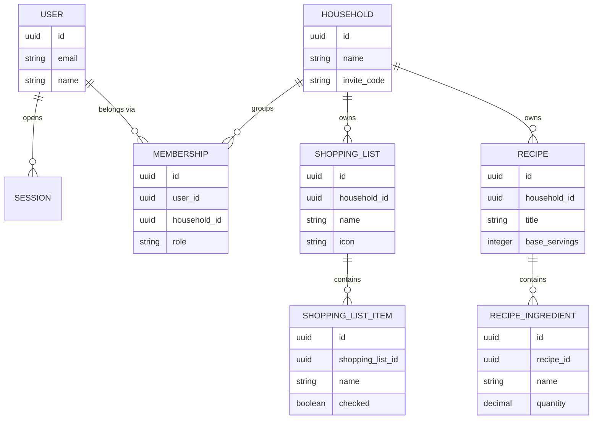
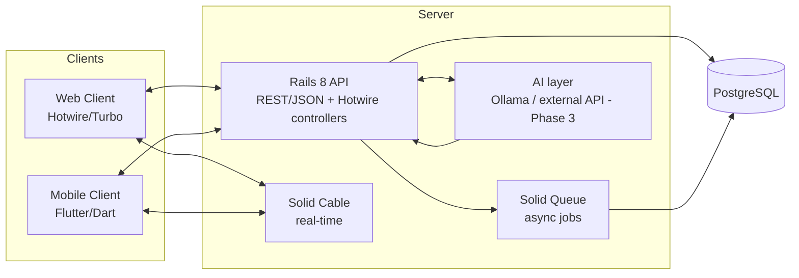

## Collaborative, free household management application

**Version:** 1.0 — first working draft **Status:** living document, iterated alongside detailed design and development

---

## Table of contents

0. Preamble
1. Project goals
2. Scope and phasing
3. Business model, license, and governance
4. Technical architecture
5. Cross-cutting architecture decisions to confirm
6. Behaviors common to all modules
7. Authentication and dashboard
8. Marketing site, documentation, and governance
9. Priority modules — Wave 2.a
10. Simple satellite modules — Wave 2.b
11. Modules with richer business logic — Wave 2.c
12. Modules with an architectural deviation — Wave 2.d
13. Hest.AI — Target vision (Phase 3)
14. Mobile application
15. API interface
16. External dependencies — validated choices
17. Appendices
18. Proposed roadmap and next steps
19. Identified future work (out of V1 scope)

---

## 0. Preamble

Hestia is a collaborative web and mobile household management application, designed as a free, open-source, self-hostable alternative to proprietary apps of the same kind. The household is the base unit: a household account groups several members (a couple, a family, roommates) who share the same modules in real time — shopping, calendar, recipes, fridge, tasks, and about twenty other everyday domains.

Unlike equivalent commercial applications, Hestia caps no feature behind a subscription: the project is distributed under the AGPLv3 license, the code is public, and anyone can host their own instance without depending on a third-party service or paying anything.

This document is the first version of Hestia's functional and technical specification. It covers all 25 target modules in enough detail to start detailed design and then development, module by module. It originally assumed that no line of code had been written yet; that is no longer the case at all: the foundation (Phase 1) and all 25 modules (Phase 2, waves 2.a to 2.d) are already scaffolded in the code — see section 0.1 for what's done and what remains. The architecture decisions (section 4) remain settled design choices; they are broadly honored by the current implementation. Turning this spec into an ordered backlog lives in the companion document *Implementation Plan — Hestia.md*.

---

## 0.1 Status (as of July 5, 2026)

Contrary to this document's original assumption ("no line of code has been written yet"), the repository already contains a complete implementation of this spec's functional scope, including most of the cross-cutting work items identified in the previous review. This section takes stock; the module-by-module detail and the version-by-version detail live respectively in *Implementation Plan — Hestia.md* and *CHANGELOG.md*.

**Already done:**

- **Technical foundation** (section 4): Rails 8.1, PostgreSQL, Solid Queue / Solid Cable / Solid Cache, Hotwire (Turbo + Stimulus), ViewComponent, Tailwind v4, Docker / Kamal, continuous integration (`.github/workflows/ci.yml`: tests + RuboCop + Brakeman + bundler-audit).
- **Phase 1 — Application foundation, complete**: `User`, `Session`, `Household`, `Membership` (`member`/`admin` role, generated unique invite code), multi-household scoping (`Current.household`, `HouseholdScoped` concern), sign-up, onboarding (create/join a household via code), active-household switching, dashboard (`root`).
- **Phase 2 — all 25 modules, waves 2.a through 2.d.** Each module has its model(s), controller, views (`Ui::*` components + Tailwind), and most of the real-time layer (Turbo Streams / Solid Cable via `broadcasts_to` / `broadcasts_refreshes_to`). The 4 architecture deviations from section 5 are implemented as described there: `user_id` scoping for Wellbeing, a `Circle` independent of the household, public token-based sharing for Gifts, a cross-cutting `trip_id` for Trips. A business-logic service layer per domain already exists for some modules (`Courses::AddItem`, `Frigo::AddItem`, `Tasks::CreateTask`, `Recipes::ImportFromUrl`, `Calendar::CreateEvent`, `Budget::SettleProject`, `Waste::GenerateSeries`, `Recurrence`…), in line with the Hest.AI groundwork (section 5, point 5) — to be generalized to the modules that don't have one yet. PDF export (Shopping, Calendar) and recipe import from a URL (schema.org/Recipe) are implemented. 83+ test files (models, controllers, services) cover this scope.
- **UI component library**: about fifty reusable components (buttons, dialogs, calendar, charts, combobox…) exposed on the `/design-system` route. This asset, not planned in v1.0 of this document, has sped up every shipped module's interface.
- **Reminders and notifications**: `Notification`, `NotificationPreference` (per-user preferences), `TaskReminder`, `EventReminder`, Solid Queue jobs `Reminders::DeliverDue` (due dates) and `Reminders::DailyDigest` (daily recap, `config/recurring.yml`), unread-notifications badge in the layout. Covers Tasks, Calendar, Fridge (expiration); the Birthdays same-day notification still needs to be wired onto this same infrastructure (see Implementation Plan).
- **External dependencies — technical integrations** (section 16): Open Food Facts for barcode scanning (`OpenFoodFacts::LookupProduct`, Shopping/Fridge), Nominatim geocoding for address search (`Geocoding::SearchAddress`, name/address/GPS pre-fill). Still not integrated: external calendar sync (scaffold in place, real OAuth/CalDAV flow not implemented — see below) and the Hest.AI LLM.
- **Reference content** (section 16): `LoyaltyBrand` (loyalty-brand catalog, about ten seeded to start), `PlantReference` (care sheets for Outdoor, six seeded to start), `HolidayReference` (public holidays for France/Belgium/Switzerland, country configurable per household). These three enrich Loyalty, Outdoor, and Calendar respectively without blocking use of the module in their absence.
- **API `api/v1`**: `ApiToken` (opaque per-user token, HMAC-SHA256 fingerprint, plaintext token never stored), `Api::V1::BaseController` (token auth, household scoping always server-side, standardized pagination), REST/JSON endpoints for the 5 wave-2.a modules (Shopping, Fridge, Recipes, Tasks, Calendar). Token management from `/api_tokens`. The pattern is in place; still needs to be extended to the other 20 modules.
- **Flutter mobile client skeleton** (`mobile/`): `ApiClient` (HTTP to `api/v1`, Bearer token), API-token login screen, read-only Shopping screen. Not a functional app — untested (no Flutter SDK in the development environment), no functional parity with the other 24 modules, no camera/dictation/push/offline/real-time. Serves as a starting point, see `mobile/README.md`.
- **Marketing site, documentation, governance** (section 8): `LICENSE` (AGPLv3), a real `README.md`, `CONTRIBUTING.md`, `CHANGELOG.md` are now in place at the repo root.

**Still to build:**

- **External calendar sync — real flow.** `ExternalCalendarConnection` and the per-provider connection screen (Google/Microsoft/CalDAV) exist, but the actual OAuth/CalDAV flow isn't implemented: `connect` tells the user that application credentials (to be supplied by the host via `bin/rails credentials:edit`) are required, rather than faking a connection.
- **Birthdays same-day notification**: the notification infrastructure (`Notification`, `Reminders::*` jobs) exists for Tasks/Calendar/Fridge; a daily trigger for today's birthdays still needs to be wired onto it.
- **API `api/v1` — 20 remaining modules**: only wave 2.a (Shopping, Fridge, Recipes, Tasks, Calendar) is exposed via the API; the 2.b/2.c/2.d modules have no REST endpoints yet, which limits the mobile app's functional parity accordingly.
- **Mobile application — functional parity**: only a skeleton (login + read-only Shopping) exists. Still to build: screens for the other 24 modules, native camera (scan, document capture), voice dictation, push notifications, contact import, offline mode, and a real-time connection (WebSocket to Solid Cable — the client currently only does one-off HTTP).
- **Hest.AI (Phase 3)**: not started, per the planned sequencing (section 2).
- **Marketing site and user documentation**: beyond the governance files (`LICENSE`/`README`/`CONTRIBUTING`/`CHANGELOG`), there is no public marketing site yet, nor a per-module user documentation hub (section 8).
- **Roadmap page** within the application itself, publicly showing progress and planned improvements — see section 18.

**Settled reconciliations** between this document and the actual code (the diagram in section 17.1 is illustrative):

- the login identifier is `email_address` (Rails 8 convention), not `email`;
- primary keys are `bigint` integers (Rails default), not `uuid`;
- `User` has a `name` field (for displaying members across modules);
- `Membership` carries a `role` (`member` / `admin`, the household's creator being `admin`) to eventually reserve sensitive actions (invitations, deleting the household) — see section 6.

---

## 1. Project goals

- Offer a complete, free, open-source alternative to existing freemium household management apps.
- Enable simple self-hosting (Docker / docker-compose) for households that want to control their own personal data.
- Eventually cover the same functional domains as a leading market app (25 modules), with no paywall or usage cap.
- Build an architecture generic enough to absorb, in the final phase, Hest.AI, the assistant able to act inside the app (not just answer in text), without major technical debt.
- Keep a technical foundation simple enough for a "coding project lead" profile to maintain: strong Rails conventions, minimal dependencies (Solid Queue / Solid Cable rather than Redis / Sidekiq), Docker deployment from day one.
- Build a project open to external contributions, following the example of the Sure project.

---

## 2. Scope and phasing

**Phase 1 — Foundation.** `User`, `Session`, `Household`, `Membership` models (with invite codes), authentication, multi-household scoping. This is the unavoidable technical prerequisite: no Phase 2 module can start before this foundation is laid and validated. *(Complete — see section 0.1.)*

**Phase 2 — Functional modules.** *(Status: the 25 modules across the four waves below are implemented in the code — models, controllers, views, real-time; the per-module gap detail lives in* Implementation Plan — Hestia.md *, the summary in section 0.1.)* Split into four waves, from the daily-use core toward more peripheral or architecturally trickier uses:

- **2.a — Priority modules (5)**: Shopping, Calendar, Tasks, Fridge, Recipes. Highest usage frequency and strongest interconnections (Recipes ↔ Shopping ↔ Fridge ↔ Menu); building these first validates the "household scoping + real-time" pattern on representative cases.
- **2.b — Simple satellite modules (11)**: Notes, Birthdays, Addresses, Service Providers, Loyalty, Pets, Vehicles, Wine Cellar, Waste, Baby, Messages. Eleven modules that reuse the same pattern (list + detail + search/filter + household scope), with a few one-off specifics (barcodes, date color-coding, contact import).
- **2.c — Modules with richer business logic (5)**: Menu, Routines, Outdoor, Budget, Documents. Recurrence logic, financial calculations, reference catalogs, or file storage.
- **2.d — Modules with an architectural deviation (4)**: Gifts, Circles, Trip, Wellbeing. Grouped last because each involves one of the deviations from the standard model detailed in section 5 (unauthenticated public sharing, breaking household scoping, a cross-cutting sub-context, strict per-user privacy).

**Phase 3 — Hest.AI.** A generic action layer letting an LLM (self-hosted Ollama or an external API) act inside the already-shipped modules. Positioned after all of Phase 2: it needs a sufficient number of stable modules to have real cross-cutting value. Documented in detail in section 13.

This sequence is a working proposal, adjustable to real time constraints — the priority is to quickly ship a usable core (2.a) before broadening functional coverage.

---

## 3. Business model, license, and governance

Unlike the freemium model of an equivalent commercial application (a free plan capped per module, a paid plan lifting the caps and unlocking entire modules), Hestia takes a radically different stance, aligned with the Sure project (sure.am):

- **Everything is free.** No feature, no module, no content cap (number of items, recipes, notes...) is reserved for a paid tier. Every capability described in this document is natively available from install.
- **Everything is open-source**, under the AGPLv3 license: the code is public, modifiable, and any distributed modification must itself be released under the same license — which prevents a third-party company from privatizing the project.
- **Native self-hosting**: Hestia is designed to run on its own infrastructure (Docker / docker-compose), with no mandatory dependency on a third-party cloud service.
- **No official hosted version in this first iteration**: following Sure's example, a managed hosting offering may come later, without ever gating the features themselves.
- **Governance open to external contributions**, framed by a `CONTRIBUTING.md` file (see section 8).

---

## 4. Technical architecture

Summary of decisions already made:

|Area|Chosen option|Why (in brief)|
|---|---|---|
|Product concept|Open-source clone of a collaborative household management app|Keep the value of real-time, multi-module usage, with a self-host / no-subscription philosophy|
|License|AGPLv3|Prevents a company from privatizing the code without releasing its changes (Sure's model)|
|Backend / Web|Ruby on Rails 8|Development velocity for a "coding project lead" profile, strong conventions, Sure's choice|
|Real-time|Hotwire/Turbo + ActionCable (Solid Cable)|Native real-time, no dependency on an external service like Redis|
|Async jobs|Solid Queue|Replaces Sidekiq/Redis, simplifies self-hosting (a single process to run)|
|Database|PostgreSQL|More robust for multi-user use and future scaling; avoids any later migration|
|Mobile|Flutter/Dart, a thin client consuming the Rails API|A single iOS/Android codebase, a model proven by Sure, no SEO constraint on mobile|
|Public web / SEO|Not relevant to the app itself|The app is private, behind login; only a future marketing site would need SEO|
|Built-in AI|A "tools" architecture on the Rails side (Ollama LLM or an external API + defined actions) — the assistant is named **Hest.AI**|Lets the AI actually act in the app in a secure, controlled way, not just answer in text|
|Deployment|Docker / docker-compose from day one|Consistent with the self-host philosophy, also eases a future official cloud deployment|
|Data architecture|Systematic per-household scoping (multi-tenant)|Guarantees strict data isolation between two different households|
|Repo structure|Monorepo: `server/` (Rails) and `mobile/` (Flutter) side by side|Keeps everything in one place for contributors, while clearly isolating responsibilities|
|Windows environment|WSL2 (Ubuntu) rather than native Windows Ruby|Avoids native gem compilation issues, consistent with the production Linux environment|
|UI components|ViewComponent library (shadcn-style) + Tailwind v4, already in place|Visual consistency and velocity across every module's views; shares the design across screens (see section 0.1)|

**Prerequisite.** The `User`, `Session`, `Household`, `Membership` (with invite codes) models make up Phase 1 (section 2); it's complete, as are all 25 Phase 2 modules at the functional level (models, controllers, views, real-time). See the detailed status in section 0.1 for the remaining gaps (reminders/notifications, reference content, external integrations, API, mobile, Hest.AI, marketing site/governance).

---

## 5. Cross-cutting architecture decisions to confirm

Several modules don't follow the standard pattern of "a record belongs to a household, a household never sees another household's data." These deviations must be consciously agreed on before starting work on the modules concerned, since they affect the core data model and the authorization layer:

1. **Circles — breaking household scoping.** A Circle brings together people beyond the household (extended family, friends), potentially belonging to different Hestia households. Requires a `Circle` entity independent of `Household`, with its own membership table and its own visibility rules (posts visible only to circle members, not the whole household).
2. **Gifts — unauthenticated public sharing.** Wish lists must be viewable and reservable by relatives who don't have a Hestia account, via a simple public link (token). Requires a public route, with restricted read/write access, outside the usual authenticated scope.
3. **Trip — cross-cutting sub-context.** A trip reuses several modules (shopping, notes, tasks, addresses, menu, budget) but with data isolated from the "everyday" household. Rather than duplicating every module into a "trip" version, it's recommended to design a generic context/project concept that records can be attached to in addition to the household (e.g. a nullable `trip_id` column on the modules concerned), reusable for possible future contexts (an event, a renovation...).
4. **Wellbeing — strict privacy.** This is the only module whose data is never visible to other household members, including admins. Requires scoping by user (`user_id`) rather than by household, with a dedicated authorization check that must be tested as a priority (risk of sensitive data leaking if implemented incorrectly).
5. **Hest.AI — cross-cutting action layer.** The assistant must be able to read and write across most modules in a controlled way. This means designing, from the very first modules, a consistent per-domain interface or service object (e.g. `Courses::AddItem`, `Frigo::ComputeExpiration`) that the assistant can invoke as "tools," rather than letting each controller carry its own business logic in isolation.

---

## 6. Behaviors common to all modules

Unless stated otherwise in a module's own section, the following rules apply by default across all of Hestia:

- **Household scope.** Any data created by a member is visible and editable by every member of the same household.
- **Real-time.** Every creation, update, deletion, or reordering is instantly propagated to other connected members (Hotwire/Turbo Streams via Solid Cable), with no manual refresh.
- **Flat permissions.** No fine-grained roles by default (identical read/write for every household member) — to be confirmed/refined if a need for a "household admin" role emerges (e.g. managing invitations, deleting the household).
- **Search.** Simple text search (name / content) is planned on high-volume modules (Shopping, Notes, Addresses, Service Providers, Vehicles, Recipes...).
- **Web/mobile parity.** Every feature must be accessible from both the web client (Rails/Hotwire) and the mobile client (Flutter), except for strictly hardware-bound capabilities (e.g. camera for scanning, which will have a "photo upload" equivalent on the web).
- **No paid tier.** No feature described in this document is restricted by a content cap or a subscription.

For each module, this document presents: its goal, its detailed functional scope, its specific business rules, its main data entities, any exceptions to the common rules above, and its interconnections with other modules.

---

## 7. Authentication and dashboard

**Sign-up.** Creating an account (email + password, or possibly OAuth if chosen during detailed design) followed by a choice: create a new household, or join an existing one via an invite code. This flow relies on the `User`, `Household`, `Membership` (with invite code) models planned in Phase 1 (section 2).

**Login.** Session-based authentication (`Session` model, planned in Phase 1), with multi-session support: a user can be logged in on several devices at once.

**Forgot password.** A classic email flow (time-limited reset token) — requires configuring an email-sending service (SMTP or a third-party service), to be settled as an additional external dependency (see section 16).

**Dashboard (home).** A home screen aggregating the most relevant cross-cutting household information at that moment: fridge items close to expiring, upcoming birthdays, overdue tasks, upcoming calendar events, suggestions for the day. This screen carries no logic of its own: it consumes already-built modules in read mode, and so should be designed last within each wave of modules (or completed progressively, wave after wave).

---

## 8. Marketing site, documentation, and governance

This section covers the pieces that accompany the application without being part of it:

- **Repo and license — done.** `LICENSE` (AGPLv3, unmodified official text), `README.md` (overview, tech stack, Docker and local quick start, tests, repo layout), `CONTRIBUTING.md` (dev environment, code conventions, expected tests, pull request process), `CHANGELOG.md` (Keep a Changelog format, a full history since `v1.0.0-beta1`) are in place at the repo root.
- **Roadmap page — done.** A page reachable from within the app (dedicated route, see Implementation Plan) publicly shows phase-by-phase/module-by-module progress and the list of planned improvements (from the codebase audit, see section 19), built on the existing `Ui::*` library rather than a separate visual identity.
- **Marketing site** (optional, can ship after the first module waves): a home page presenting the project, one page per module (modeled on this spec), a Hest.AI presentation page, and emphasis on the project's free / open-source / self-hostable nature — the opposite of a pricing page. **Not started**: the Roadmap page above covers a limited slice of this (progress), not the project's marketing presentation.
- **Resource center / user documentation**: usage guides per module, likely as a static documentation site generated from Markdown files versioned with the code. **Not started.**
- **Legal notice, terms of service, privacy policy, cookies**: to adapt to the self-hosted context. A self-hosted instance doesn't carry the same obligations as a commercial SaaS service, but a privacy policy is still recommended as soon as a household hosts other members' data (and even more so third-party data via the public Gift link or Circles). **Not started.**

---

## 9. Priority modules — Wave 2.a

### 9.1 Shopping

**Goal.** Maintain one or more shopping lists shared by the household, organized for speed in-store and automatically fed by other modules (recipes, fridge, menu).

**Functional scope.**

- A default shopping list plus unlimited themed lists, each named and given an icon (e.g. "Saturday grocery run," "Cabin trip shopping").
- Adding an item by free text entry, barcode scan, or selection from the household's catalog.
- Household product catalog: a reusable reference of products already added (name, brand, aisle), for quick search-based adding.
- Automatic sorting of items by aisle (produce, fresh, pantry, personal care, etc.).
- Checking an item off as "picked up" in-store; a checked item disappears visually but stays tracked until the list is finalized/cleared.
- PDF export of a list for printing or sharing outside the app.
- Moving an item to the Fridge module (with an expiration date entered) once purchased.

**Business rules.**

- Sorting by aisle relies on an aisle ↔ product-category reference table, still to be built (an open reference, editable by the household on top of it).
- Merging duplicates and converting units when adding a recipe's ingredients is the Recipes module's responsibility (see 9.5); the Shopping module simply receives an already-normalized list in Phase 2 (automatic smart merging is a Hest.AI, Phase 3 capability).
- Barcode scanning should rely on an open product database rather than a proprietary one — a decision point (section 16).

**Main entities.** `ShoppingList` (name, icon, household), `ShoppingListItem` (name, quantity, unit, aisle, checked/unchecked state, sort position, optional catalog product), `Product` (household reference: name, brand, aisle, barcode).

**Interconnections.** Recipes (adding ingredients), Fridge (item ↔ product back-and-forth with a date), Menu (anticipating the week's purchases), Loyalty (loyalty card accessible while shopping).

---

### 9.2 Calendar

**Goal.** Centralize all of the household's appointments and events in a shared calendar, syncable with members' external calendars.

**Functional scope.**

- Four views: list, day, week, month — the last view used is remembered per user.
- Events with a title, time, custom color/type, participants (assigned household members), optional location.
- Recurrence: weekly/monthly frequencies with a customizable interval ("every 2 weeks"), automatically ending after N occurrences or on a given date.
- Custom reminders per event, with a configurable delay and recipient (yourself or another member).
- Filtering the display by household member.
- Public holidays highlighted (France / Belgium / Switzerland reference data, selectable).
- Two-way sync with external calendars (Google via OAuth, Outlook via MSAL, iCloud via CalDAV): external events show up in Hestia, and events created in Hestia flow back into native calendars.
- PDF export of the displayed month.

**Business rules.**

- Editing a single occurrence of a recurring event must not affect the other occurrences in the series (unless the user explicitly chooses "edit the whole series").
- External sync must preserve the source color/calendar to visually distinguish an imported event's origin.

**Main entities.** `CalendarEvent` (title, start, end, location, color/type, recurrence rule, recurrence end), `EventParticipant` (event, member), `EventReminder` (event, delay, recipient), `ExternalCalendarConnection` (household or member, provider, OAuth/CalDAV token).

**Interconnections.** Birthdays (a complementary dedicated view), Routines (similar recurrence logic, to share technically), Menu (optionally generating an event per meal), Tasks (due dates shown on the calendar).

---

### 9.3 Tasks

**Goal.** List, assign, and track the household's one-off tasks, with flexible organization (due date, owner, category).

**Functional scope.**

- A shared task list, with an optional long description and an emoji.
- A due date with a color code that evolves as the date approaches.
- Assignment to a household member (avatar shown on the card).
- Manual drag-and-drop reordering, and automatic sorting (by due date or by owner) on demand.
- Custom categories, shown as tabs, with a kanban view per category.
- Custom reminders (date, time, recipient).
- Voice dictation for quick creation.
- Text search across tasks.

**Business rules.**

- A task assigned to a member can still be checked off by any household member (no exclusive lock).
- Automatic sorting reorders the list at that moment but doesn't prevent a later manual reorder.

**Main entities.** `Task` (title, description, emoji, due date, owner, position, category, done/not-done state), `TaskCategory` (name, household), `TaskReminder` (task, date/time, recipient).

**Interconnections.** Calendar (tasks with a due date shown there), Routines (distinguishing a one-off task from a recurring one), Notes (promoting a note into an actionable task), Birthdays (tasks tied to a birthday: buying a gift, a cake...).

---

### 9.4 Fridge

**Goal.** Give a shared, up-to-date view of what's in the fridge, freezer, and pantry, to cut down on food waste.

**Functional scope.**

- Three locations managed separately: fridge, freezer (toggleable), pantry.
- Adding a product by picking it from a reference list, searching online, scanning a barcode, or manual entry, with an expiration date and a location.
- Automatic color coding based on the due date (past due / today-tomorrow / 2 to 3 days / beyond).
- Prepared dishes with a dedicated photo (batch cooking, leftovers, homemade sauces).
- Per-member configurable expiration notifications.
- Text search within the fridge's contents.
- Two-way bridge with the shopping list (a purchased item → a fridge product with a date; a fridge product to restock → a shopping item).

**Business rules.**

- The color code is computed server-side from the expiration date and the current day (not fixed at creation time), so it stays correct with no user action.
- In Phase 2, a prepared dish's expiration date is entered manually by the user. Automatically computing this date from the ingredients and storage method, with an explanation of the limiting factors, is a Hest.AI (Phase 3, see section 13) capability.

**Main entities.** `FridgeItem` (name, location, expiration date, optional photo, optional catalog product), `PreparedDish` (name, date, location, photo, an explanation of the shelf life if computed by the AI).

**Interconnections.** Shopping (back-and-forth), Recipes (the fridge's contents inform recipe choice), Menu (planning around what's already there).

---

### 9.5 Recipes

**Goal.** Build a household-shared recipe book, fed manually, imported from the web, or via Hest.AI, and connected to shopping and the fridge.

**Functional scope — Phase 2 (no AI).**

- Manual creation (ingredients, steps, time, photo), categories and tags.
- Basic import of a recipe from an external URL via a standard microdata parser (schema.org/Recipe), present on most cooking sites.
- Full-screen reading mode that keeps the screen awake, for cooking without touching the phone.
- Search across the household's recipes.
- Simple adding of ingredients to the shopping list (no smart duplicate merging in Phase 2).

**Target scope — Phase 3 (Hest.AI capabilities, see section 13).**

- Iterative conversational creation until validated, automatic serving-size adjustment (recalculating quantities and steps), image generation for recipes without a photo, nutrition estimation (calories, protein, carbs, fat, salt, fiber), smart adding to shopping (merging duplicates, converting units, distinguishing meat/fish types).

**Business rules.**

- A community of recipes shared between households is flagged as future work, out of this V1's scope — see section 19.

**Main entities.** `Recipe` (title, photo, prep/cook time, base servings, category, tags, source/original URL), `RecipeIngredient` (recipe, name, quantity, unit), `RecipeStep` (recipe, order, content), `NutritionEstimate` (recipe, calories, protein, carbs, fat, salt, fiber — filled in during Phase 3).

**Interconnections.** Shopping (exporting ingredients), Fridge (suggestions based on what's on hand), Menu (meal planning), Notes (an informal recipe that migrates to Recipes), Wine Cellar (food-wine pairing, a thematic link).

---

## 10. Simple satellite modules — Wave 2.b

### 10.1 Notes

**Goal.** Offer a shared, free-form notebook for anything that doesn't yet fit a structured module.

**Functional scope.**

- Rich formatting (headings, bold, italics, lists), a background image on the card.
- Favorites (pinning to the top of the list) and archiving (removing from the main view without deleting).
- Instant search on title and content.
- Voice dictation for creation.

**Business rules.** No complex business rules: an intentionally simple module, with strong potential for content to migrate to other modules (task, recipe).

**Main entities.** `Note` (title, rich content, image, favorite, archived, household, author).

**Interconnections.** Tasks (promoting to an actionable task), Recipes (an informal recipe that migrates), Documents (a context note alongside a scanned document), Messages (notes for what should last, messages for one-off exchanges).

---

### 10.2 Birthdays

**Goal.** Keep every date that matters (family, friends, various contacts) in a shared household notebook, with visual lead time.

**Functional scope.**

- A chronological list view and a calendar view.
- Color coding based on how close the date is (today / this week / this month / beyond).
- Date of birth with an optional year (no age calculation if the year is missing).
- Import from the phone's contacts (mobile), with a photo if available.
- Custom tags (family, friends, coworkers...) with tag-based filtering.
- A light same-day notification.

**Business rules.** The same contact can carry several tags. The color code is computed dynamically (recalculated daily), not fixed at creation time.

**Main entities.** `Contact` (shared with Gifts), `ContactTag` (name, emoji, household), `ContactTagging` (contact, tag).

**Interconnections.** Gifts (a shared contact record), Calendar (a complementary view), Circles (birthdays shared beyond the household), Budget (a collective gift fund).

---

### 10.3 Addresses

**Goal.** Build an address book of places the household visits or recommends (restaurants, leisure, culture...).

**Functional scope.**

- Fourteen address types (restaurant, café, bar, hotel, shop, park, museum, cinema, theater, wellness, landmark, tourism, private address, other).
- Creation via online search (pre-filling name/address/phone/photo/GPS coordinates) or manual entry (for confidential addresses).
- Geolocation (opening directions) and calling directly from the entry.
- A personal 1-to-5 rating.

**Business rules.** Online search requires a geocoding/places service — a decision point (section 16).

**Main entities.** `Address` (type, name, full address, GPS coordinates, phone, photo, rating, household).

**Interconnections.** Trip (an equivalent, isolated notebook), Recipes (a restaurant tied to a dish), Service Providers (distinguishing a place to visit from a professional to hire), Calendar (an outing planned from an address).

---

### 10.4 Service Providers

**Goal.** Keep the contact details of professionals the household relies on within easy reach.

**Functional scope.**

- One entry per provider: name, customizable type (icon + color), phone, email, address.
- Manual creation or import from the phone's contacts (mobile).
- Filtering by type, search by name.
- Direct action buttons: call, email, directions.

**Business rules.** Provider types are fully customizable per household (no fixed list imposed by the app).

**Main entities.** `ServiceProvider` (name, type, phone, email, address, household), `ServiceProviderType` (name, icon, color, household).

**Interconnections.** Pets (vet, groomer), Outdoor (gardener, pool technician), Vehicles (mechanic), Calendar (an associated appointment), Documents (a provider's contract/quote).

---

### 10.5 Loyalty

**Goal.** Gather the household's loyalty cards to present at checkout without a physical wallet.

**Functional scope.**

- A catalog of pre-configured brands (logo, colors, code format) to build up progressively — see section 16 — with the user only entering their card number.
- A custom card outside the catalog (free-form name + number) for brands not yet listed.
- Full-screen display of the barcode or QR code to scan at checkout.
- Manual reordering of the cards.

**Business rules.** The code format (barcode/QR) must be detected or chosen when creating an out-of-catalog card, for correct on-screen rendering.

**Main entities.** `LoyaltyBrand` (catalog: name, logo, code format), `LoyaltyCard` (brand or free-form name, number, format, position, household).

**Interconnections.** Shopping (used together while shopping), Addresses (frequented brands), Budget (a thematic link to reducing spend).

---

### 10.6 Pets

**Goal.** Centralize health and care tracking for the household's pets.

**Functional scope.**

- One entry per pet: name, type, breed, weight, ID, date of birth (computed age), photo.
- A Vaccinations tab (name, injection date, booster date, price), highlighting overdue boosters.
- A Treatments tab (name, frequency, quantity, last given, price).
- A Recurring Supplies tab (food, litter) with an order link and next-order date.

**Business rules.** Deliberately a non-medical module: practical organization, not meant to replace an official veterinary health record — to be called out in the interface to avoid any confusion.

**Main entities.** `Pet` (name, type, breed, weight, ID, date of birth, photo, household), `PetVaccination`, `PetTreatment`, `PetSupply`.

**Interconnections.** Shopping (restocking recurring supplies), Calendar (vet appointments), Routines (daily walk, litter cleaning), Service Providers (vet, groomer, boarding).

---

### 10.7 Vehicles

**Goal.** Keep the household's vehicle maintenance log and anticipate inspection deadlines.

**Functional scope.**

- One entry per vehicle: name, type (car/motorcycle), make, license plate, year, fuel type, photo.
- Tracking the inspection's expiry date, with a color code based on how close the deadline is.
- Maintenance history (a predefined or free-text operation type, date, cost, provider, description).
- Search by name, make, or license plate.

**Business rules.** The inspection color code uses fixed thresholds (beyond 90 days / under 90 / under 30 / overdue) — to keep as-is or adjust during detailed design.

**Main entities.** `Vehicle` (name, type, make, license plate, year, fuel type, inspection date, photo, household), `VehicleMaintenanceEntry` (vehicle, type, date, cost, provider, description).

**Interconnections.** Service Providers (mechanic, inspection center), Budget (maintenance cost in expenses), Calendar (a garage appointment), Trip (a check before a long drive).

---

### 10.8 Wine Cellar

**Goal.** Track the household's bottle inventory, organized across several cellars if needed.

**Functional scope.**

- One entry per bottle: photo, name, vintage, region, type.
- Multiple possible cellars (by region, by type, by maturity...) with moving a bottle from one cellar to another.
- Marking a bottle in/out (consumed) to reflect actual stock.
- Search within the cellar.

**Business rules.** No limit on the number of bottles or cellars — consistent with the project's "everything is free" principle (section 3).

**Main entities.** `WineCellar` (name, household), `Bottle` (cellar, name, vintage, region, type, photo, in-stock/out state).

**Interconnections.** Recipes (food-wine pairing), Menu (choosing wine for a planned meal), Shopping (restocking at the wine merchant), Budget (a leisure expense).

---

### 10.9 Waste

**Goal.** Give a clear, durable view of trash collection days, without depending on an external municipal calendar.

**Functional scope.**

- A monthly calendar with five collection types (trash, recycling, glass, compost, bulky items), each with its own color/icon.
- Generating a recurring series (weekday + frequency in weeks + covered period) in a single action.
- Adding, editing, or deleting a single occurrence without affecting the rest of the series; deleting the whole series if needed.

**Business rules.** Purely manual entry: no integration with a municipal collection calendar in Phase 2 (no universal open data source identified in France at this stage); to be reassessed if a reliable public API becomes available city by city.

**Main entities.** `WasteCollectionSeries` (type, weekday, frequency, period), `WasteCollectionEvent` (date, type, optional source series).

**Interconnections.** Routines (an alternative for the "take out the bin" reminder), Calendar (two separate views, no technical merge), Outdoor (garden compost vs. municipal collection).

---

### 10.10 Baby

**Goal.** Make it easier for caregivers to jointly track an infant's day-to-day.

**Functional scope.**

- A baby is added as a special household member (a dedicated option when creating the member).
- A feeding timer (bottle or breastfeeding), with a duration history.
- Tracking food introduction (food introduced, acceptance level).
- Tracking tested allergens (introduction date, observed severity).

**Business rules.** The module is explicitly presented as an organizational aid, not a substitute for pediatric medical tracking.

**Main entities.** `BabyProfile` (a household member flagged as "baby"), `FeedingSession` (type, start, end, duration), `FoodIntroduction` (food, date, acceptance level), `AllergenTest` (allergen, date, severity).

**Interconnections.** Service Providers (pediatrician), Calendar (check-ups, vaccines), Shopping (diapers, formula).

---

### 10.11 Messages

**Goal.** Let household members chat directly within the app, alongside the modules the conversation relates to.

**Functional scope.**

- 1-to-1 or group conversations between household members.
- Guided creation (conversation name + selecting participants).
- Adding participants to an existing conversation.
- Per-conversation settings (name, participant list).

**Business rules.** Deliberately limited to the household's scope (no messaging outside it); for exchanges with people outside the household, the Circles module (12.2) is the right tool.

**Main entities.** `Conversation` (name, household), `ConversationParticipant` (conversation, member), `Message` (conversation, author, content, date).

**Interconnections.** Calendar, Shopping, Tasks (contextual discussions), Circles (an internal exchange vs. sharing moments).

---

## 11. Modules with richer business logic — Wave 2.c

### 11.1 Menu

**Goal.** Plan meals for the week (or several weeks) to reduce the mental load of "what's for dinner tonight."

**Functional scope.**

- A week view with several meals per day (breakfast, lunch, dinner, snacks, free-form).
- A meal is either pulled from a recipe in the book (a direct link) or a free-text name for improvised meals.
- Drag-and-drop to reorder meals within a day; changing the date via the meal's entry to move it to another day.
- Quick editing (changing the name/recipe) and two-step deletion.

**Business rules.** A meal linked to a deleted recipe should fall back to a "free-text name" with the recipe's name kept as text, rather than producing a display error.

**Main entities.** `MealPlanEntry` (date, meal type, position within the day, optional recipe, optional free-text name, household).

**Interconnections.** Recipes (the source of planned meals), Shopping (anticipating purchases), Fridge (building the menu around what's on hand), Budget (anticipating the shopping budget).

### 11.2 Routines

**Goal.** Track what recurs regularly in the household (cleaning, upkeep, care) with recurrence logic and a completion history.

**Functional scope.**

- Daily/weekly/monthly/yearly frequencies, with a custom interval ("every 2," "every 3"…) and a precise day (weekday, day of month, month of year).
- Assignment to a member (indicative — anyone can complete a routine assigned to someone else).
- Themed lists with tabs (morning, evening, cleaning, garden...).
- Automatic recalculation of the next due date on each completion, with a dated history (who, when).
- A visual overdue indicator if the due date has passed without completion.

**Business rules.** The recurrence engine is conceptually shared with the Calendar's (same frequency/interval logic) — to be shared via a common service rather than duplicating the code.

**Main entities.** `Routine` (name, emoji, description, frequency, interval, target day/date, owner, themed list, household), `RoutineCompletion` (routine, date, author).

**Interconnections.** Tasks (distinguishing one-off vs. recurring), Calendar (complementary framing of the week), Waste (taking out the bins, an alternative to a dedicated series), Outdoor (watering, pool upkeep).

### 11.3 Outdoor

**Goal.** Track the household's garden (plants) and pool(s) over time.

**Functional scope.**

- A Garden tab: one entry per plant (photo, custom name, location), linked to a catalog reference entry (water needs, pruning, fertilizing, common diseases).
- A Pool tab (toggleable): one or more pools, each with a treatment type (chlorine, salt, bromine, active oxygen, UV) determining the relevant reading fields.
- Dated readings (pH, treatment level, temperature) and maintenance actions (cleaning the filter, winterizing, start-up, other).
- A full, browsable history.

**Business rules.** The plant catalog (reference sheets) is content to build up or import from an open database — see section 16. Without this content, the module still works but without the care-assistance value.

**Main entities.** `PlantReference` (catalog: common name, scientific name, needs), `Plant` (reference, custom name, location, photo, household), `Pool` (name, treatment type, household), `PoolReading` (pool, date, measurement type, value), `PoolAction` (pool, date, action type).

**Interconnections.** Routines (recurring watering, filter cleaning), Shopping (fertilizer, treatment products), Service Providers (gardener, pool technician), Calendar (seasonal winterizing, start-up).

### 11.4 Budget

**Goal.** Give an overview of the household's finances (income, expenses, savings) and manage shared expenses between several people with automatic reimbursement calculations.

**Functional scope.**

- A dashboard with a monthly/yearly toggle: income, expenses, savings capacity, disposable income.
- Typed categories (income / expense / savings) with an emoji and color, freely created.
- A budget-health gauge computed from the savings rate or disposable income.
- Savings envelopes with recurring contributions, automatically deducted from savings capacity.
- Shared expense projects (vacation, shared housing, renovations): defined participants, expenses entered with their payer, automatic calculation of who owes whom how much.

**Business rules.** The split calculation for a shared project must handle the case where a participant isn't a household member (e.g. a friend invited to a one-off project) — a point tied to the Circles/out-of-household contacts discussion (section 5).

**Main entities.** `BudgetCategory` (type, name, emoji, color, household), `BudgetEntry` (category, amount, frequency), `SavingsEnvelope` (name, recurring contribution), `SharedProject` (name, participants), `SharedExpense` (project, amount, payer, description, date).

**Interconnections.** Trip (the same split engine), Gifts (a collective fund), Menu/Shopping (anticipating the grocery budget line).

### 11.5 Documents

**Goal.** Scan and centralize the household's important papers to find and share them in seconds.

**Functional scope.**

- Photo capture turned into a readable PDF.
- Organization by color-coded folders (school, car, home, admin, customizable).
- Built-in PDF reading within the app.
- Sharing by email or the device's native messaging, in two taps.
- Search by document name.

**Business rules.** The module is designed for everyday paperwork, not as a certified vault for the most sensitive data nor as a substitute for a professional medical file — to be called out in the interface. File storage (PDFs, photos) requires a dedicated storage strategy (a Docker volume or S3-compatible object storage) — see section 16.

**Main entities.** `Document` (name, folder, PDF file, date added, household), `DocumentFolder` (name, color, household).

**Interconnections.** Service Providers (a provider's contract/quote), Vehicles (registration, maintenance invoices), Budget (invoices feeding tracked expenses), Pets (vaccination record, insurance).

---

## 12. Modules with an architectural deviation — Wave 2.d

### 12.1 Gifts

**Goal.** Centralize gift ideas to receive and to give, with a public sharing mechanism so relatives can reserve them.

**Functional scope.**

- Two perspectives: "To receive" (my own wishes, to share) and "To give" (my ideas for others, by contact and by to-give/given status).
- Themed lists by occasion (Christmas, birthday...), with sub-categories.
- A private list visible only to a chosen subset of household members (preparing a surprise gift).
- Sharing a "To receive" list via a public link, viewable and reservable with no account (a named or anonymous reservation).
- Per-idea details: recipient contact, estimated price, product link, image, free-text comment, status.

**Business rules.** The creator of a private list can't remove themselves from it, to avoid accidentally spoiling a surprise for themselves. The recipient contact is shared with the Birthdays module (a single contact record for both uses).

**Main entities.** `GiftList` (name, public/private visibility, household), `GiftListShare` (list, public token), `GiftIdea` (list, contact, price, link, image, comment, status), `Contact` (name, photo, optional date of birth — an entity shared with Birthdays), `GiftReservation` (idea, the reserving person's name or anonymous, no account required).

**Exception to household scope.** Viewing/reserving via the public link is unauthenticated, outside the household — see section 5.

**Interconnections.** Birthdays (a shared contact record), Circles (sharing beyond the household), Budget (a collective fund/project for a group gift), Calendar (birthdays/holidays that trigger the need).

### 12.2 Circles

**Goal.** Offer private sharing spaces between chosen relatives, beyond the household's scope.

**Functional scope.**

- Creating or joining a circle (extended family, friends, neighbors...) via an invite/link.
- A feed of text and/or photo posts, visible only to circle members.
- Custom reactions (choosing an emoji from a palette, beyond a simple "like").
- Simple moderation: a post's author or a circle admin can delete it.

**Exception to household scope.** See section 5 — a Circle isn't tied to a household but groups individual users, potentially from different Hestia households.

**Main entities.** `Circle` (name, theme), `CircleMembership` (circle, user, admin/member role), `CirclePost` (circle, author, text, photo), `CirclePostReaction` (post, user, emoji).

**Interconnections.** Birthdays, Gifts (sharing beyond the household), Trip (shared memories), Messages (a circle for sharing moments over time, messages for direct exchange).

### 12.3 Trip

**Goal.** Provide an isolated project space per stay, grouping the useful modules (shopping, notes, tasks, addresses, menu, budget) without cluttering the household's general lists.

**Functional scope.**

- Creating a trip (name, dates) with an à-la-carte activation of the useful sub-modules.
- A shopping sub-list, practical notes, tasks/prep, a dedicated address book, meal plans for the stay, a shared budget with split calculations between participants.
- Reordering/deactivating active tabs at any time.
- Deleting the trip = deleting all data attached to it (an irreversible action, to be explicitly confirmed in the UI).

**Business rules.** See section 5 — this implies a generic context/project concept rather than duplicating every module. By default, every household member is attached to the trip's budget; the participant list stays adjustable.

**Main entities.** `Trip` (name, dates, household, active tabs), and, for each module concerned, an optional `trip_id` association alongside `household_id` on `ShoppingListItem`, `Note`, `Task`, `Address`, `MealPlanEntry`, `BudgetExpense`.

**Interconnections.** Addresses (a general book vs. an isolated trip book), Budget (the same split logic as shared projects), Shopping, Notes, Tasks, Menu (all in a "trip-isolated" version).

### 12.4 Wellbeing

**Goal.** Let each household member track their weight and physical activity in a strictly private way.

**Functional scope.**

- Dated weigh-ins with an automatically generated curve from two entries onward.
- Personal information (height, age, sex, activity level, starting weight and goal).
- BMI shown for information only.
- Workout sessions (exercise type, duration) with a full history.
- Freely editing/deleting entries.

**Exception to household scope.** All of this module's data is scoped per user (`user_id`), never per household: no other member, not even a household admin, should be able to access it. This is the most sensitive exception in the permission system — to be covered by dedicated authorization tests as a priority.

**Main entities.** `WellbeingProfile` (user, height, age, sex, activity level, starting weight, goal), `WeightEntry` (user, date, weight), `WorkoutEntry` (user, date, exercise, duration).

**Interconnections.** Deliberately minimal, to preserve the module's isolation (no direct technical link to Recipes or Routines, only a thematic link mentioned to the user in the interface).

---

## 13. Hest.AI — Target vision (Phase 3)

**Status in this document.** This section describes the target vision for **Hest.AI**, Hestia's conversational assistant. It's deliberately placed after all the functional modules (Phase 3): an assistant that acts inside the app is only valuable once there are enough stable modules to act on. It's documented as early as this V1 so that the modules' architecture choices (Phase 2) anticipate this layer — notably point 5 of section 5.

**Goal.** Offer, alongside each module, a built-in conversational assistant that doesn't just answer in text but acts directly inside the app (creating a recipe, adding to shopping, planning a meal...), under the user's explicit approval before any actual action.

**How it works.**

- A single entry point (a button in the header, present on every route), opening the conversation in a side panel (web) or full screen (mobile).
- Conversation memory from one exchange to the next.
- Contextual awareness of the household: fridge contents, shared calendar, overdue tasks, favorite recipes, upcoming birthdays.
- Any proposed action requires the user's explicit approval before it executes ("it proposes, the user confirms").

**Target capabilities, by module.**

- **Recipes**: conversational creation (iterating until approved), serving-size adjustment (recalculating quantities and steps), image generation for recipes without a photo, nutrition estimation.
- **Shopping**: smart adding to the list (merging duplicates, converting units, distinguishing meat/fish types).
- **Fridge**: computing a prepared dish's expiration date from its ingredients and storage method, with an explanation of the limiting factors.
- **Notes / Tasks**: voice dictation and assisted creation.
- **Cross-cutting**: meal planning, scheduling reminders, suggestions based on the household's context (what's in the fridge, who has a birthday coming up, which tasks are overdue).

**Chosen architecture.** A "tools" architecture on the Rails side: the LLM (self-hosted Ollama, or an external API of the host's choice) never touches the database directly; it invokes explicitly exposed actions (per-domain application services, see section 5 point 5), which keeps control over what the assistant can actually do and lets its actions be logged.

**Product caution.** The assistant acts on the household's shared data, not just an isolated user's — except for the Wellbeing module, whose strict privacy (section 5, point 4) must be respected even by the assistant: it must never access this module's data on behalf of a member other than the current user.

**Assistant name.** Hest.AI — chosen to match the project's identity (Hestia + AI).

---

## 14. Mobile application

**Status.** A Flutter/Dart skeleton now lives in `mobile/`: `ApiClient` (HTTP to `api/v1`, token in an `Authorization: Bearer` header), an API-token login screen (generated from `/api_tokens`), a read-only Shopping screen. This isn't a functional app — untested (no Flutter SDK available in the development environment where the skeleton was created), no functional parity, no real-time. See `mobile/README.md` for what's left to build, and section 0.1 for the summary.

The mobile client is a thin Flutter/Dart client consuming the Rails API (see section 15), in line with the architecture decision already made. It carries no business logic of its own: every business rule lives server-side, to guarantee identical behavior between web and mobile.

**Functional scope.** Functional parity with the web client across all the modules listed in sections 9 to 12, plus mobile-specific additions:

- Native camera access for barcode scanning (Shopping, Fridge) and document capture (Documents).
- Voice dictation via the phone's native speech-recognition APIs (Notes, Tasks).
- Native push notifications (reminders, expirations, overdue routines).
- Contact import from the phone's address book (Birthdays, Service Providers).
- Offline mode for already-synced data (at least read-only) — to be specified more precisely during detailed design.

**Authentication.** A user session via an API token (to be decided: JWT or an opaque Rails-side token), with transparent renewal for the user.

**Real-time.** A WebSocket connection to Solid Cable to receive live updates, the same way the Hotwire web client does.

---

## 15. API interface

**Status.** The `api/v1` API exists: `ApiToken` (an opaque per-user token, an indexed HMAC-SHA256 fingerprint, the plaintext token never stored, manageable from `/api_tokens`), `Api::V1::BaseController` (token authentication, household resolution always server-side, `?page`/`?per_page` pagination, uniform 401/404/422 handling), REST/JSON endpoints for Shopping, Fridge, Recipes, Tasks, Calendar (wave 2.a). The guiding principles below are honored by this first slice; the pattern still needs to be extended to the other 20 modules (see Implementation Plan §6).

The Rails API serves both the web client (consumed internally by the Hotwire/Turbo controllers) and the Flutter mobile client (consumed externally over HTTP/JSON), as well as Hest.AI's eventual action layer (Phase 3).

**Guiding principles.**

- A versioned REST/JSON API (e.g. `/api/v1/...`), with token authentication for external clients (mobile).
- Systematic server-side household scoping: every request is filtered by the authenticated user's household, never by a client-supplied parameter (to prevent any data leak between households).
- Standardized pagination and filtering on list endpoints (shopping, notes, addresses...).
- A dedicated per-household real-time channel (Solid Cable) for broadcasting updates, alongside classic REST responses.

**Expected appendices** (to produce during detailed design, see section 17): a sequence diagram for a representative flow (e.g. adding a shopping item, propagated in real time to all members), an overall technical flow diagram (web client / mobile client / Rails API / database / job queue / real-time channel).

---

## 16. External dependencies — validated choices

Several capabilities described in this document rely on third-party data or services. The 9 choices below have been validated: they're no longer open questions, but settled decisions, most of which are now implemented (see the detailed status in section 0.1).

|Capability|Module(s)|Chosen dependency (validated)|Status|
|---|---|---|---|
|Product database / barcode scanning|Shopping, Fridge|An open database such as Open Food Facts|**Done** — `OpenFoodFacts::LookupProduct`|
|Geocoding / place search|Addresses|An open service such as OpenStreetMap/Nominatim, or a commercial API|**Done** — `Geocoding::SearchAddress` (Nominatim)|
|Plant catalog (care sheets)|Outdoor|An open database or content to build up|**Done** — `PlantReference`, 6 sheets seeded to start, to enrich progressively|
|Loyalty brand catalog|Loyalty|Content to build up progressively (community)|**Done** — `LoyaltyBrand`, about ten brands seeded to start; the "out of catalog" card remains available|
|External calendar sync|Calendar|Google OAuth, Microsoft MSAL, Apple CalDAV|**Scaffold in place** — `ExternalCalendarConnection` and the connection screen exist; the real OAuth/CalDAV flow requires application credentials on the host's side, not yet implemented|
|Recipe import from a URL|Recipes|A basic microdata parser (schema.org/Recipe), enriched by Hest.AI in Phase 3|**Done**|
|Sending emails|Authentication (Phase 1)|Self-hosted SMTP or a third-party service, configurable at install|**Done**|
|LLM for Hest.AI|Hest.AI (Phase 3)|Self-hosted Ollama or an external API, configurable at install (already settled in section 4)|Not started (Phase 3)|
|File storage|Documents|A local Docker volume or S3-compatible object storage|**Done** — Active Storage|

---

## 17. Appendices

This first version includes two illustrative diagrams, to kick off technical thinking. Detailed per-module diagrams (API sequence, state transitions, use cases) will be produced during each module's detailed design, rather than all at once in this V1.

### 17.1 Conceptual data model — cross-cutting core

### 17.2 System architecture — overview

### 17.3 Diagrams still to produce (per module, during detailed design)

- An API sequence diagram (per representative user flow).
- A user flow per module.
- A state-transition diagram (e.g. the lifecycle of a task, of a trip).
- A use-case diagram (per profile: household member, public guest via a Gift link, admin).

---

## 18. Proposed roadmap and next steps

This roadmap is also published inside the application itself (the **Roadmap** page, see Implementation Plan §8), for members and contributors, with the detail of planned improvements (section 19 and beyond, an extended list kept in the app rather than duplicated here).

|Phase|Content|Status|
|---|---|---|
|1|Foundation: `User`, `Session`, `Household`, `Membership`|Done (see §0.1)|
|2.a|Shopping, Calendar, Tasks, Fridge, Recipes|Implemented, including reminders/notifications and Open Food Facts; external calendar sync as a scaffold (real OAuth/CalDAV flow missing), see §0.1|
|2.b|Notes, Birthdays, Addresses, Service Providers, Loyalty, Pets, Vehicles, Wine Cellar, Waste, Baby, Messages|Implemented, including Nominatim geocoding (Addresses) and the brand catalog (Loyalty); missing the same-day notification (Birthdays), see §0.1|
|2.c|Menu, Routines, Outdoor, Budget, Documents|Implemented, including the plant reference catalog (Outdoor), see §0.1|
|2.d|Gifts, Circles, Trip, Wellbeing|Implemented per the architecture deviations in section 5|
|—|API `api/v1` (wave 2.a) + Flutter mobile skeleton|Implemented for 5 modules / non-functional skeleton — see §0.1, §14, §15|
|—|Governance: `LICENSE`, `README`, `CONTRIBUTING`, `CHANGELOG`, Roadmap page|Done — see section 8|
|3|Hest.AI ("tools" layer)|Not started, vision documented in this spec|

**Suggested next steps.**

1. Wire the Birthdays same-day notification onto the reminders/notifications infrastructure already in place (Tasks/Calendar/Fridge).
2. Implement the real OAuth/CalDAV flow for external calendar sync (the `ExternalCalendarConnection` scaffold and connection screen already exist).
3. Extend the `api/v1` API to the 20 remaining modules (waves 2.b/2.c/2.d), to enable the mobile client's functional parity.
4. Build the Flutter mobile client's functional parity beyond the current skeleton: screens for the 24 remaining modules, native camera, dictation, push, offline, real-time (see section 14).
5. Lay the groundwork for a public marketing site and a user documentation hub (section 8) — beyond the governance files already in place.
6. Once a critical mass of modules has been refined, start Hest.AI (Phase 3).
7. Keep iterating on this document as implementation feedback comes in: it's a living spec, not a fixed contract.

---

## 19. Identified future work (out of V1 scope)

This V1 focuses on the scope settled in section 2. Some ideas identified while writing this document are deliberately not folded into the current roadmap, but are worth tracking so they aren't lost:

- **A cross-household recipe community.** Let Hestia households publish some recipes from their book (the Recipes module, section 9.5) and draw from those published by other households, beyond the strictly private book planned for V1. This requires a cross-household shared-content infrastructure (a publishing space, minimal moderation, dedicated search), distinct from the rest of the app's private-by-default behavior. To be reassessed once Phase 2 has shipped, based on the actual number of active Hestia instances/households rather than settled in this V1.

More future work can be added to this list as feedback comes in, without waiting for a full new version of the spec.
